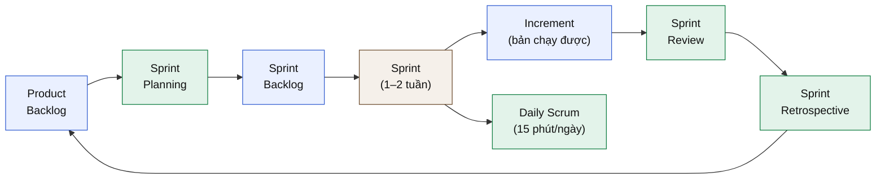
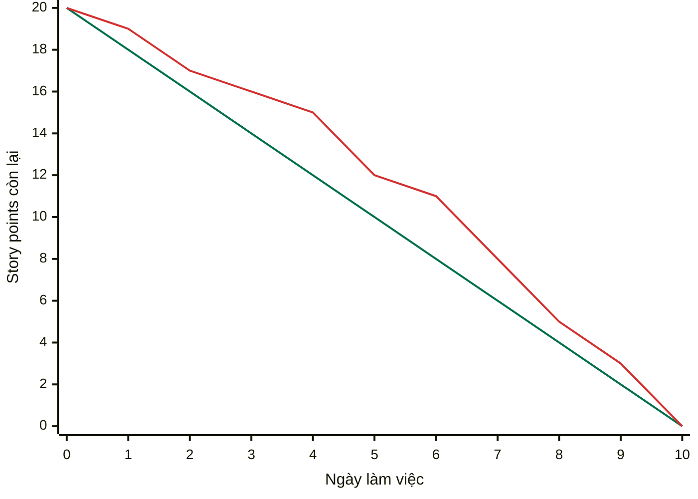
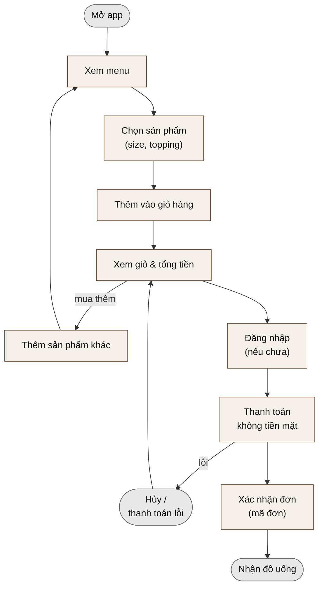
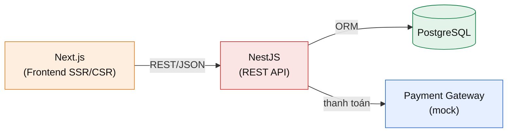
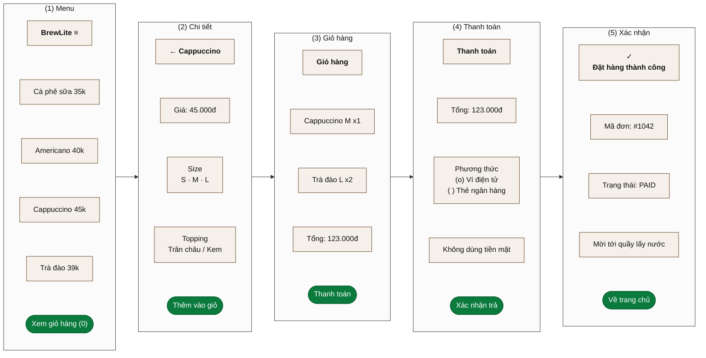
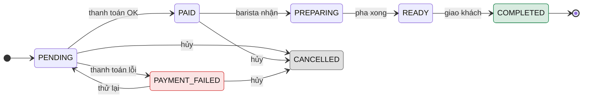

TRƯỜNG ĐẠI HỌC SÀI GÒN

KHOA CÔNG NGHỆ THÔNG TIN

# SOFTWARE ENGINEERING

---

**Bài tập lớn:**

## BrewLite

**VER 1.0**

---

Môn học: Công nghệ Phần mềm

Học kỳ: I – Năm học 2026–2027

TP. HỒ CHÍ MINH, NĂM 2026

---

## Mục lục

| Mục | Trang |
|---|---:|
| **1 Tóm tắt** | 2 |
| **2 Tổng quan quy trình Agile Scrum** | 2 |
| &emsp;2.1 Vai trò, Sự kiện, Tạo phẩm | 2 |
| &emsp;2.2 Vòng lặp Scrum | 2 |
| &emsp;2.3 Kế hoạch 3 Sprint cho BrewLite (gợi ý) | 2 |
| &emsp;2.4 Sprint Burndown chart (biểu đồ mẫu) | 2 |
| **3 Sản phẩm và người dùng** | 3 |
| &emsp;3.1 Product Vision | 3 |
| &emsp;3.2 Các bên liên quan (Stakeholders) | 3 |
| **4 Yêu cầu phần mềm (Requirements)** | 3 |
| &emsp;4.1 Yêu cầu chức năng (Functional) | 3 |
| &emsp;4.2 Yêu cầu phi chức năng (Non-functional) | 3 |
| &emsp;4.3 User Story tiêu biểu (mẫu để viết) | 4 |
| **5 Luồng nghiệp vụ: từ chọn sản phẩm đến thanh toán** | 4 |
| **6 Kiến trúc và công nghệ** | 4 |
| **7 Giao diện MVP tham khảo (wireframe)** | 5 |
| **8 Product Backlog: 10 task theo Scrum** | 5 |
| **9 Task 10 – nghiệp vụ backend** | 6 |
| &emsp;9.1 Sơ đồ máy trạng thái đơn hàng (Order State Machine) | 6 |
| **10 Definition of Done** | 7 |
| **11 Bàn giao sản phẩm cho khách hàng** | 7 |
| **12 API và chức năng tối thiểu** | 7 |
| &emsp;12.1 Một số endpoint chính | 7 |
| &emsp;12.2 Thực thể tối thiểu | 7 |

## 1 Tóm tắt

> **Tóm tắt nội dung**
>
> Đây là bài tập lớn cho nhóm sinh viên môn *Công nghệ Phần mềm*. Nhóm sẽ xây dựng **BrewLite** – một ứng dụng *đặt cà phê không dùng tiền mặt* – theo **quy trình Agile Scrum** đầy đủ, từ *thu thập yêu cầu* (requirements), *kịch bản* (scenario), *phát triển* (development) cho đến *bàn giao sản phẩm* cho khách hàng. Sản phẩm tối thiểu (**MVP**) trải dài từ lúc khách *chọn sản phẩm* đến lúc *thanh toán*. Đề bài gồm **10 task** (mỗi task **1 điểm**, tổng **10 điểm**) theo Scrum. Công nghệ bắt buộc: **NestJS** (Backend) + **Next.js** (Frontend).

## 2 Tổng quan quy trình Agile Scrum

### 2.1 Vai trò, Sự kiện, Tạo phẩm

| Nhóm yếu tố | Thành phần |
|---|---|
| Vai trò (Roles) | Product Owner (PO), Scrum Master (SM), Development Team. |
| Sự kiện (Events) | Sprint Planning, Daily Scrum, Sprint Review, Sprint Retrospective. |
| Tạo phẩm (Artifacts) | Product Backlog, Sprint Backlog, Increment (sản phẩm tăng dần). |

### 2.2 Vòng lặp Scrum

### 2.3 Kế hoạch 3 Sprint cho BrewLite (gợi ý)

| Sprint | Mục tiêu (Sprint Goal) | Task |
|---|---|---|
| Sprint 1 | Nền tảng & hiển thị menu | Task 1, 2, 3, 4 |
| Sprint 2 | Giỏ hàng & đặt đơn & đăng nhập | Task 5, 6, 7 |
| Sprint 3 | Thanh toán, bàn giao & nghiệp vụ nâng cao | Task 8, 9, 10 |

### 2.4 Sprint Burndown chart (biểu đồ mẫu)

*Burndown chart* theo dõi **khối lượng công việc còn lại** (story points) giảm dần theo từng ngày trong một Sprint. Đường *lý tưởng* (Ideal) là mục tiêu giảm đều; đường *thực tế* (Actual) phản ánh tiến độ thật của nhóm. Ví dụ dưới đây cho một Sprint 2 tuần (10 ngày làm việc, tổng 20 điểm).

**Lý tưởng (Ideal)** – đường xanh lá, giảm đều từ 20 về 0; **Thực tế (Actual)** – đường đỏ.

Số liệu của biểu đồ

| Ngày làm việc | 0 | 1 | 2 | 3 | 4 | 5 | 6 | 7 | 8 | 9 | 10 |
|---|---|---|---|---|---|---|---|---|---|---|---|
| Lý tưởng (Ideal) | 20 | 18 | 16 | 14 | 12 | 10 | 8 | 6 | 4 | 2 | 0 |
| Thực tế (Actual) | 20 | 19 | 17 | 16 | 15 | 12 | 11 | 8 | 5 | 3 | 0 |

> **Cách đọc:** nếu đường *thực tế* nằm *trên* đường *lý tưởng* ⇒ nhóm đang chậm tiến độ; nằm *dưới* ⇒ vượt tiến độ. Daily Scrum dùng biểu đồ này để phát hiện rủi ro sớm và điều chỉnh phạm vi Sprint. Mỗi nhóm cập nhật số điểm còn lại *cuối mỗi ngày*.

## 3 Sản phẩm và người dùng

### 3.1 Product Vision

> *“BrewLite giúp khách hàng đặt và thanh toán đồ uống **không dùng tiền mặt** chỉ trong vài chạm, giảm thời gian xếp hàng và nhận đơn nhanh tại quầy.”*

### 3.2 Các bên liên quan (Stakeholders)

- **Khách hàng:** đặt đồ uống, chọn size/topping, thanh toán không tiền mặt và theo dõi trạng thái đơn.
- **Nhân viên quầy/Barista:** tiếp nhận đơn và cập nhật trạng thái pha chế. Chức năng này nằm ngoài phạm vi MVP và là phần mở rộng.
- **Quản lý cửa hàng/Product Owner:** xác định yêu cầu, ưu tiên Product Backlog và nghiệm thu Increment sau mỗi Sprint.
- **Giảng viên nghiệm thu:** đánh giá quy trình, sản phẩm và mức độ đáp ứng các tiêu chí chấp nhận.
- **Nhóm phát triển:** phân tích, thiết kế, lập trình, kiểm thử và bàn giao hệ thống.
- **Đơn vị thanh toán:** cung cấp hoặc được mô phỏng qua cổng thanh toán Ví/Thẻ trong phạm vi bài tập lớn.

## 4 Yêu cầu phần mềm (Requirements)

### 4.1 Yêu cầu chức năng (Functional)

1. Hiển thị danh sách (menu) đồ uống kèm hình, tên, giá.
2. Xem chi tiết sản phẩm, chọn *size* và *topping*.
3. Thêm/sửa/xóa sản phẩm trong *giỏ hàng*; tự tính tổng tiền.
4. Đăng ký / đăng nhập tài khoản (JWT).
5. Tạo đơn hàng và *thanh toán không tiền mặt*.
6. Hiển thị xác nhận đơn (mã đơn, trạng thái) và lịch sử đơn.

### 4.2 Yêu cầu phi chức năng (Non-functional)

- Thời gian phản hồi API < 500ms với dữ liệu mẫu.
- Bảo mật: mật khẩu băm (hash), token JWT, validate dữ liệu đầu vào.
- Phù hợp trên các trình duyệt web.

### 4.3 User Story tiêu biểu (mẫu để viết)

> **US-05 – Thanh toán không tiền mặt**
>
> *Là một* khách hàng, *tôi muốn* thanh toán đơn bằng ví điện tử/thẻ, *để* tôi không cần mang tiền mặt.
>
> **Tiêu chí chấp nhận (Acceptance Criteria):**
>
> - Khi giỏ hàng có ít nhất 1 sản phẩm, nút “Thanh toán” hiển thị tổng tiền.
> - Chọn phương thức (Ví / Thẻ) rồi xác nhận ⇒ tạo đơn ở trạng thái `PAID`.
> - Nếu thanh toán lỗi, đơn ở trạng thái `PAYMENT_FAILED` và giỏ hàng được giữ nguyên.
> - Sau khi thành công, hiển thị mã đơn và màn hình xác nhận.

## 5 Luồng nghiệp vụ: từ chọn sản phẩm đến thanh toán

Luồng nghiệp vụ chính (happy path) của MVP:

## 6 Kiến trúc và công nghệ

Frontend **Next.js** gọi REST API của backend **NestJS**; NestJS dùng một CSDL (gợi ý PostgreSQL qua Prisma/TypeORM) và tích hợp cổng thanh toán giả lập (mock payment gateway).

| Thành phần | Công nghệ |
|---|---|
| Frontend | Next.js (React, TypeScript), TailwindCSS, React Query/Zustand (giỏ hàng) |
| Backend | NestJS (TypeScript), REST, class-validator, JWT (Passport) |
| CSDL | PostgreSQL + Prisma (hoặc TypeORM) |
| Thanh toán | Mock Payment Service (mô phỏng Momo/VNPay/Stripe) |
| DevOps | Docker Compose, Git, README bàn giao |

## 7 Giao diện MVP tham khảo (wireframe)

Năm màn hình cốt lõi từ *chọn sản phẩm* đến *xác nhận thanh toán*. Sinh viên có thể bám theo bố cục này khi dựng UI bằng Next.js.

## 8 Product Backlog: 10 task theo Scrum

Mỗi task là một hạng mục backlog, sắp xếp **từ dễ đến khó** và phân vào các Sprint. Mỗi task hoàn thành (đạt Definition of Done ở Mục 10) được **1 điểm**, tổng **10 điểm**.

| # | Task (Story) | Yêu cầu / Tiêu chí chấp nhận chính | Điểm |
|---|---|---|---:|
| 1 | Khởi tạo dự án và cấu trúc | Tạo monorepo/2 thư mục `frontend` (Next.js) + `backend` (NestJS), chạy được “Hello”, có README, Git, `.env.example`. | 1 |
| 2 | API danh sách sản phẩm | NestJS `GET /products` trả về JSON menu (id, tên, giá, ảnh) từ dữ liệu mẫu/CSDL. | 1 |
| 3 | Trang Menu (Frontend) | Next.js gọi `/products`, render lưới sản phẩm, có loading/empty state. | 1 |
| 4 | Chi tiết và tùy chọn sản phẩm | Màn hình chi tiết: chọn size (S/M/L) và topping; tính giá theo tùy chọn. | 1 |
| 5 | Giỏ hàng (Cart) | Thêm/sửa số lượng/xóa; lưu state (Zustand/Context); tự tính tổng tiền; badge số lượng. | 1 |
| 6 | API tạo đơn hàng | NestJS `POST /orders` nhận giỏ hàng, validate (class-validator), lưu đơn trạng thái `PENDING`, trả mã đơn. | 1 |
| 7 | Đăng ký / Đăng nhập (JWT) | `POST /auth/register`, `/auth/login`; băm mật khẩu (bcrypt); phát JWT; guard bảo vệ route đặt đơn. | 1 |
| 8 | Thanh toán không tiền mặt | Tích hợp *mock payment*: chọn Ví/Thẻ, gọi `POST /payments`; đơn chuyển `PAID` khi thành công, `PAYMENT_FAILED` khi lỗi. | 1 |
| 9 | Xác nhận, lịch sử đơn & bàn giao | Màn hình xác nhận (mã đơn, trạng thái) và `GET /orders/me` (lịch sử đơn); `docker-compose` chạy cả 3 (frontend, backend, DB); README; demo end-to-end. | 1 |
| 10 | Nghiệp vụ backend | State Machine đơn hàng, thanh toán idempotent, kiểm soát tồn kho khi đặt đồng thời, khuyến mãi/điểm thưởng (chi tiết ở Mục 9). | 1 |
| | | **Tổng** | **10** |

## 9 Task 10 – nghiệp vụ backend

> **Task 10: Xử lý đặt hàng và thanh toán.**
>
> Hiện thực *nghiệp vụ backend thực tế* trong NestJS bao gồm **cả 4** yêu cầu:
>
> 1. **Order State Machine:** `PENDING` → `PAID` → `PREPARING` → `READY` → `COMPLETED`; chặn chuyển trạng thái không hợp lệ.
> 2. **Thanh toán idempotent:** dùng *Idempotency-Key* để cùng một yêu cầu thanh toán lặp lại *không bị trừ tiền/đặt đơn 2 lần*.
> 3. **Kiểm soát tồn kho khi đặt đồng thời:** khi nhiều khách đặt cùng lúc, dùng *transaction* + *optimistic locking* để không bán quá số lượng nguyên liệu/sản phẩm còn lại.
> 4. **Khuyến mãi và điểm thưởng (loyalty):** áp mã giảm giá hợp lệ và cộng điểm tích lũy cho khách sau khi đơn `PAID`.
>
> **Tiêu chí chấm:** có *unit/integration test* chứng minh: (a) chặn được chuyển trạng thái sai; (b) gửi 2 lần cùng Idempotency-Key chỉ tạo 1 đơn; (c) đặt đồng thời không vượt tồn kho.

### 9.1 Sơ đồ máy trạng thái đơn hàng (Order State Machine)

Sơ đồ dưới đây mô tả các trạng thái hợp lệ của một đơn hàng và các chuyển tiếp được phép. *Mọi chuyển tiếp không có mũi tên* sẽ bị hàm `assertTransition` chặn lại (ném lỗi). `COMPLETED` và `CANCELLED` là trạng thái *kết thúc*.

> **Mô tả:** đi theo *luồng xanh* (đường ngang) là trạng thái thành công: `PENDING` → `PAID` → `PREPARING` → `READY` → `COMPLETED`. Các nhánh *đỏ/xám* là ngoại lệ: thanh toán lỗi (`PAYMENT_FAILED`, có thể *thử lại*) hoặc *hủy* đơn (`CANCELLED`).

## 10 Definition of Done

Một task được tính điểm khi thỏa **Definition of Done (DoD)**:

- Code chạy được, không lỗi build; tuân theo tiêu chí chấp nhận của task.
- Có commit trên Git với mô tả rõ ràng; được review trong nhóm.
- API có validate đầu vào; UI xử lý trạng thái loading/lỗi cơ bản.
- Có hướng dẫn chạy trong README.

## 11 Bàn giao sản phẩm cho khách hàng

Ở cuối Sprint cuối, nhóm tổ chức buổi **Sprint Review / Demo** đóng vai bàn giao cho giảng viên:

1. Trình diễn luồng end-to-end: chọn sản phẩm → giỏ hàng → thanh toán → xác nhận đơn.
2. Bàn giao mã nguồn (Git), `docker-compose` chạy được, README.
3. Trình bày *Sprint Retrospective*: điều làm tốt, điều cần cải thiện.
4. Nhận phản hồi của “khách hàng” và ghi nhận backlog cho phiên bản sau.

## 12 API và chức năng tối thiểu

### 12.1 Một số endpoint chính

| Endpoint | Chức năng |
|---|---|
| `GET /products` | Danh sách sản phẩm (menu) |
| `GET /products/:id` | Chi tiết một sản phẩm |
| `POST /auth/register` | Đăng ký tài khoản |
| `POST /auth/login` | Đăng nhập, trả JWT |
| `POST /orders` | Tạo đơn (PENDING) |
| `POST /payments` | Thanh toán (idempotent) |
| `GET /orders/me` | Lịch sử đơn của user |

### 12.2 Thực thể tối thiểu

- **Product**(id, name, price, imageUrl, stock).
- **User**(id, email, passwordHash, loyaltyPoints).
- **Order**(id, userId, status, total, createdAt).
- **OrderItem**(id, orderId, productId, size, qty, lineTotal).
- **Payment**(id, orderId, idempotencyKey, amount, method).
