# TÀI LIỆU KIẾN TRÚC VÀ ĐẶC TẢ HỆ THỐNG PHẦN MỀM BREWLITE
## (Comprehensive System Architecture & Design Specification)

**Hệ thống:** Nền tảng Đặt đồ uống & Thanh toán không tiền mặt BrewLite (VER 1.0)  
**Môn học:** Công nghệ Phần mềm (Software Engineering) — Học kỳ I, Năm học 2026–2027  
**Khoa / Trường:** Khoa Công nghệ Thông tin — Trường Đại học Sài Gòn (SGU)  
**Chuẩn tham chiếu:** RUP / Agile Scrum Architecture Standard, ADR-007, Prisma Schema v1.0  
**Ngày cập nhật:** 23/09/2026  
**Trạng thái tài liệu:** Approved & Baseline for Production  
**Tài nguyên biểu đồ Vector & Draw.io:** Toàn bộ 11 biểu đồ đã được kết xuất sẵn dạng mã nguồn [Mermaid (.mmd)](./diagrams/) và [Vector SVG siêu nét](./diagrams/svg/) cho phép phóng to 1.000% không vỡ hạt và nhập trực tiếp vào Draw.io (`Ctrl + Shift + I`). Xem hướng dẫn chi tiết tại [DRAWIO_GUIDE.md](./DRAWIO_GUIDE.md).

---

## MỤC LỤC

1. [TỔNG QUAN HỆ THỐNG & KIẾN TRÚC TỔNG THỂ](#1-tổng-quan-hệ-thống--kiến-trúc-tổng-thể)
2. [BFD (BUSINESS FUNCTION DECOMPOSITION) — SƠ ĐỒ PHÂN RÃ CHỨC NĂNG KINH DOANH](#2-bfd-business-function-decomposition--sơ-đồ-phân-rã-chức-năng-kinh-doanh)
   - [2.1 Sơ đồ phân rã chức năng kinh doanh (Mermaid)](#21-sơ-đồ-phân-rã-chức-năng-kinh-doanh-mermaid)
   - [2.2 Bảng danh mục và từ điển phân rã chức năng](#22-bảng-danh-mục-và-từ-điển-phân-rã-chức-năng)
3. [DFD LV0 (CONTEXT DIAGRAM) — SƠ ĐỒ LUỒNG DỮ LIỆU MỨC NGỮ CẢNH](#3-dfd-lv0-context-diagram--sơ-đồ-luồng-dữ-liệu-mức-ngữ-cảnh)
   - [3.1 Sơ đồ ngữ cảnh hệ thống (Mermaid)](#31-sơ-đồ-ngữ-cảnh-hệ-thống-mermaid)
   - [3.2 Bảng từ điển luồng dữ liệu mức ngữ cảnh](#32-bảng-từ-điển-luồng-dữ-liệu-mức-ngữ-cảnh)
4. [DFD LV1 (DETAILED DATA FLOW DIAGRAM) — SƠ ĐỒ LUỒNG DỮ LIỆU MỨC 1](#4-dfd-lv1-detailed-data-flow-diagram--sơ-đồ-luồng-dữ-liệu-mức-1)
   - [4.1 Sơ đồ luồng dữ liệu mức 1 phân rã chi tiết (Mermaid)](#41-sơ-đồ-luồng-dữ-liệu-mức-1-phân-rã-chi-tiết-mermaid)
   - [4.2 Bảng từ điển kho dữ liệu (Data Store Dictionary)](#42-bảng-từ-điển-kho-dữ-liệu-data-store-dictionary)
   - [4.3 Bảng từ điển luồng dữ liệu chi tiết mức 1](#43-bảng-từ-điển-luồng-dữ-liệu-chi-tiết-mức-1)
5. [USE CASE DIAGRAM & ĐẶC TẢ KỊCH BẢN USE CASE CHUẨN ACADEMIC](#5-use-case-diagram--đặc-tả-kịch-bản-use-case-chuẩn-academic)
   - [5.1 Sơ đồ Use Case tổng quan tinh gọn (Overview — 4 Actors, 5 Packages)](#51-sơ-đồ-use-case-tổng-quan-tinh-gọn-overview--4-actors-5-packages)
   - [5.2 Sơ đồ Use Case phân rã chi tiết — Khách hàng (Customer Use Cases)](#52-sơ-đồ-use-case-phân-rã-chi-tiết--khách-hàng-customer-use-cases)
   - [5.3 Sơ đồ Use Case phân rã chi tiết — Nhân viên Barista (Staff / KDS Use Cases)](#53-sơ-đồ-use-case-phân-rã-chi-tiết--nhân-viên-barista-staff--kds-use-cases)
   - [5.4 Sơ đồ Use Case phân rã chi tiết — Quản trị viên & Tự động hóa (Admin & System Cron)](#54-sơ-đồ-use-case-phân-rã-chi-tiết--quản-trị-viên--tự-động-hóa-admin--system-cron)
   - [5.5 Đặc tả Use Case UC-01: Đặt đồ uống & Áp mã Voucher](#55-đặc-tả-use-case-uc-01-đặt-đồ-uống--áp-mã-voucher)
   - [5.6 Đặc tả Use Case UC-02: Thanh toán không tiền mặt Idempotent](#56-đặc-tả-use-case-uc-02-thanh-toán-không-tiền-mặt-idempotent)
   - [5.7 Đặc tả Use Case UC-03: Barista tiếp nhận & Cập nhật chế biến đơn tại KDS](#57-đặc-tả-use-case-uc-03-barista-tiếp-nhận--cập-nhật-chế-biến-đơn-tại-kds)
6. [ERD (ENTITY-RELATIONSHIP DIAGRAM) & DATA DICTIONARY](#6-erd-entity-relationship-diagram--data-dictionary)
   - [6.1 Sơ đồ quan hệ thực thể chuẩn hóa (Mermaid)](#61-sơ-đồ-quan-hệ-thực-thể-chuẩn-hóa-mermaid)
   - [6.2 Bảng từ điển dữ liệu (Data Dictionary khớp 100% Prisma Schema)](#62-bảng-từ-điển-dữ-liệu-data-dictionary-khớp-100-prisma-schema)
   - [6.3 Định nghĩa các kiểu liệt kê (Enumerations)](#63-định-nghĩa-các-kiểu-liệt-kê-enumerations)
7. [SEQUENCE DIAGRAMS — SƠ ĐỒ TUẦN TỰ CHO CÁC LUỒNG NGHIỆP VỤ CỐT LÕI](#7-sequence-diagrams--sơ-đồ-tuần-tự-cho-các-luồng-nghiệp-vụ-cốt-lõi)
   - [7.1 Sequence Diagram 1: Luồng Đặt hàng trừ kho Optimistic Locking](#71-sequence-diagram-1-luồng-đặt-hàng-trừ-kho-optimistic-locking)
   - [7.2 Sequence Diagram 2: Luồng Thanh toán Idempotent Replay, Race Defense P2002 & Tích điểm Loyalty](#72-sequence-diagram-2-luồng-thanh-toán-idempotent-replay-race-defense-p2002--tích-điểm-loyalty)
8. [ORDER STATE MACHINE — SƠ ĐỒ MÁY TRẠNG THÁI ĐƠN HÀNG](#8-order-state-machine--sơ-đồ-máy-trạng-thái-đơn-hàng)
   - [8.1 Biểu đồ chuyển đổi trạng thái đơn hàng (Mermaid)](#81-biểu-đồ-chuyển-đổi-trạng-thái-đơn-hàng-mermaid)
   - [8.2 Ma trận chuyển đổi trạng thái (State Transition Matrix)](#82-ma-trận-chuyển-đổi-trạng-thái-state-transition-matrix)
   - [8.3 Bảng quy tắc phân quyền và hành động biên (Invariants & Side Effects)](#83-bảng-quy-tắc-phân-quyền-và-hành-động-biên-invariants--side-effects)

---

## 1. TỔNG QUAN HỆ THỐNG & KIẾN TRÚC TỔNG THỂ

BrewLite là hệ thống phần mềm chuyên biệt phục vụ chuỗi dịch vụ cà phê và đồ uống thông minh, áp dụng mô hình vận hành không tiền mặt (Cashless Ordering & Payment). Hệ thống được thiết kế theo kiến trúc phân tầng (Layered Architecture) với sự tách biệt rõ ràng giữa tầng Client-side Web App và Server-side Microservices/Monolith Modular:

- **Frontend (Client Application):** Phát triển trên nền tảng **Next.js 14+ (React, TypeScript)**, tối ưu hiển thị menu, giỏ hàng, đồng hồ đếm ngược 15 phút thời hạn thanh toán đơn hàng (Timeout Countdown), cùng giao diện Barista Kitchen Display System (KDS).
- **Backend (API Service Engine):** Xây dựng trên framework **NestJS**, tích hợp Passport JWT, class-validator, và hệ thống máy trạng thái (Order State Machine Engine) khắt khe.
- **Tầng lưu trữ dữ liệu (Database Layer):** Sử dụng hệ quản trị cơ sở dữ liệu quan hệ **PostgreSQL 16**, kết nối và đồng bộ lược đồ thông qua **Prisma ORM**.
- **Cơ chế kiểm soát đồng thời (Concurrency Control):** Áp dụng **Optimistic Locking** trên thực thể `Product` qua trường `version` nhằm loại trừ hiện tượng bán âm kho (Overselling / Stock Race Condition).
- **Cơ chế phòng thủ thanh toán (Payment Idempotency):** Áp dụng khóa duy nhất `Idempotency-Key` kết hợp bắt lỗi xung đột mức cơ sở dữ liệu `Prisma P2002` để chống gian lận trừ tiền lặp và double-spending.

---

## 2. BFD (BUSINESS FUNCTION DECOMPOSITION) — SƠ ĐỒ PHÂN RÃ CHỨC NĂNG KINH DOANH

### 2.1 Sơ đồ phân rã chức năng kinh doanh (Mermaid)

> **Tài nguyên biểu đồ:** [Mã nguồn Mermaid (.mmd)](./diagrams/bfd.mmd) • [Ảnh Vector SVG phóng to 1.000%](./diagrams/svg/bfd.svg) • Nhập vào Draw.io: `Ctrl + Shift + I`

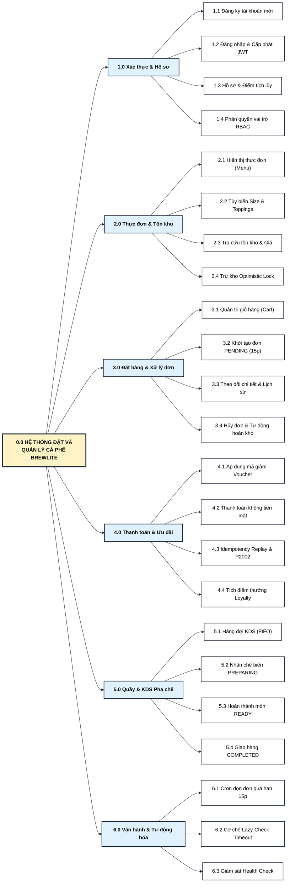

---

### 2.2 Bảng danh mục và từ điển phân rã chức năng

| Mã CN | Tên chức năng con | Mô tả chi tiết nghiệp vụ | Tác nhân thực thi | Ràng buộc nghiệp vụ liên quan |
|---|---|---|---|---|
| **F1.1** | Đăng ký tài khoản | Nhận email, password; băm mật khẩu bằng `bcryptjs` (salt 10 rounds), khởi tạo điểm Loyalty = 0. | Khách hàng mới | Email phải là duy nhất (`@unique`), định dạng hợp lệ. |
| **F1.2** | Đăng nhập & Cấp JWT | Xác thực thông tin qua passport-local, sinh `access_token` có hiệu lực 7 ngày chứa payload `{ sub, email, role }`. | Khách hàng / Nhân viên / Admin | Throttling giới hạn 5 lần đăng nhập sai/phút/IP. |
| **F1.3** | Quản lý hồ sơ & Điểm | Xem thông tin cá nhân, cấp bậc thành viên và tổng số điểm thưởng tích lũy tích lũy từ các hóa đơn đã thanh toán. | Khách hàng | Chỉ truy xuất dữ liệu thuộc quyền sở hữu của chính User. |
| **F1.4** | Phân quyền RBAC | Kiểm soát phân quyền 3 vai trò: `CUSTOMER`, `STAFF`, `ADMIN` qua NestJS Guards. | Hệ thống bảo mật | Chặn trái phép truy cập màn hình Staff/Admin (HTTP 403). |
| **F2.1** | Hiển thị thực đơn | Liệt kê toàn bộ đồ uống active kèm ảnh, tên, giá gốc, trạng thái còn hàng. | Khách hàng / Nhân viên | Trả về nhanh chóng qua REST API `GET /products` (< 100ms). |
| **F2.2** | Tùy biến đồ uống | Cho phép chọn size (S/M/L) và danh sách phụ liệu (Topping: trân châu, kem cheese...). Tự động tính đơn giá chuẩn. | Khách hàng | Size M +5.000đ, Size L +10.000đ, Topping +5.000đ - 10.000đ. |
| **F2.3** | Tra cứu tồn kho | Trả về số lượng `stock` và phiên bản đồng bộ `version` hiện hành của từng sản phẩm. | Backend Engine | Phục vụ kiểm tra điều kiện trước khi trừ kho. |
| **F2.4** | Cập nhật kho Optimistic | Trừ kho có điều kiện `WHERE id = :id AND version = :version AND stock >= :qty`. Tăng `version + 1`. | Hệ thống / DB Transaction | Nếu không có bản ghi nào được update -> Báo lỗi `409 Conflict`. |
| **F3.1** | Quản trị giỏ hàng | Lưu trữ danh sách món đã chọn trên Local State (Zustand/Local Storage), tính tổng phụ (subtotal). | Khách hàng | Đồng bộ thời gian thực phía Client trước khi gửi đơn. |
| **F3.2** | Khởi tạo đơn hàng | Nhận payload món, kiểm tra giá, áp voucher, mở transaction trừ kho và tạo đơn `PENDING` (hạn 15 phút). | Khách hàng | Gán mã định danh duy nhất `#1001`, `#1002`, `expiresAt = now() + 15m`. |
| **F3.3** | Theo dõi chi tiết đơn | Xem chi tiết thành tiền, thời hạn thanh toán còn lại, mã nhận món tại quầy, trạng thái đơn hiện hành. | Khách hàng / Nhân viên | Khách chỉ xem đơn của mình; Staff/Admin được xem tất cả. |
| **F3.4** | Hủy đơn & Hoàn kho | Chuyển đơn sang `CANCELLED` và tự động cộng trả lại số lượng tồn kho `Product.stock` tương ứng. | Khách hàng / Staff / Cron | Khách chỉ hủy khi PENDING/FAILED; Staff hủy khi PAID. |
| **F4.1** | Áp dụng Voucher | Kiểm tra tính hợp lệ của mã: ngày hết hạn, đơn tối thiểu `minOrder`, giới hạn `usageLimit > usedCount`. | Khách hàng | Tính số tiền giảm giá chính xác (% hoặc số tiền cố định). |
| **F4.2** | Thanh toán không tiền mặt | Hỗ trợ 2 phương thức: Ví điện tử (`E_WALLET`), Thẻ ngân hàng (`BANK_CARD`). | Khách hàng | Mô phỏng xác thực thanh toán thành công hoặc lỗi qua Mock Engine. |
| **F4.3** | Kiểm soát Idempotency | Chống thanh toán đúp bằng khóa `Idempotency-Key` (UUID). Nếu trùng lặp cùng đơn, trả kết quả cũ mà không trừ tiền. | Backend Engine | Bắt lỗi Race Condition `Prisma P2002` để đảm bảo an toàn tuyệt đối. |
| **F4.4** | Tích lũy Loyalty Points | Khi đơn chuyển `PAID`, tự động cộng 1 điểm cho mỗi 10.000đ thanh toán vào tài khoản khách hàng. | Hệ thống tích điểm | Chỉ cộng điểm đúng 1 lần duy nhất cho mỗi đơn hàng thành công. |
| **F5.1** | Hàng đợi KDS | Hiển thị danh sách các đơn đã thanh toán thành công theo thứ tự thời gian tăng dần (FIFO). | Nhân viên Barista | Tự động cập nhật các đơn hàng có trạng thái `PAID`, `PREPARING`, `READY`. |
| **F5.2** | Cập nhật pha chế | Chuyển trạng thái đơn từ `PAID` sang `PREPARING` khi Barista bắt đầu pha chế đồ uống. | Nhân viên Barista | Tuân thủ nghiêm ngặt theo Order State Machine. |
| **F5.3** | Báo hoàn tất món | Chuyển trạng thái từ `PREPARING` sang `READY` khi đồ uống đã hoàn thành và sẵn sàng tại quầy. | Nhân viên Barista | Kích hoạt thông báo sẵn sàng nhận đồ uống trên màn hình khách. |
| **F5.4** | Bàn giao đơn | Khách xuất trình mã đơn `#10xx`, Barista xác nhận và chuyển trạng thái sang `COMPLETED`. | Nhân viên Barista | Kết thúc toàn bộ vòng đời vận hành của đơn hàng. |
| **F6.1** | Cron dọn đơn quá hạn | Background Job chạy định kỳ mỗi 5 phút quét các đơn `PENDING` có `expiresAt < now()` để hủy và hoàn kho. | Hệ thống tự động (Cron) | Chạy ngầm độc lập qua `@nestjs/schedule`. |
| **F6.2** | Lazy-Check Timeout | Khi có request `GET /orders/:id`, nếu phát hiện đơn quá hạn sẽ chủ động hủy và hoàn kho ngay lập tức. | Backend Service | Tránh việc hiển thị đơn đã hết hạn trong thời gian chờ chu kỳ Cron. |
| **F6.3** | Giám sát trạng thái | Cung cấp endpoint `GET /api/health` kiểm tra tình trạng kết nối Database và khả năng phản hồi của Backend. | Giám sát viên / Docker | Phục vụ Docker Healthcheck và kiểm thử hệ thống tự động. |

---

## 3. DFD LV0 (CONTEXT DIAGRAM) — SƠ ĐỒ LUỒNG DỮ LIỆU MỨC NGỮ CẢNH

### 3.1 Sơ đồ ngữ cảnh hệ thống (Mermaid)

> **Tài nguyên biểu đồ:** [Mã nguồn Mermaid (.mmd)](./diagrams/dfd-lv0.mmd) &bull; [Ảnh Vector SVG phóng to 1.000%](./diagrams/svg/dfd-lv0.svg) &bull; Nhập vào Draw.io: `Ctrl + Shift + I`

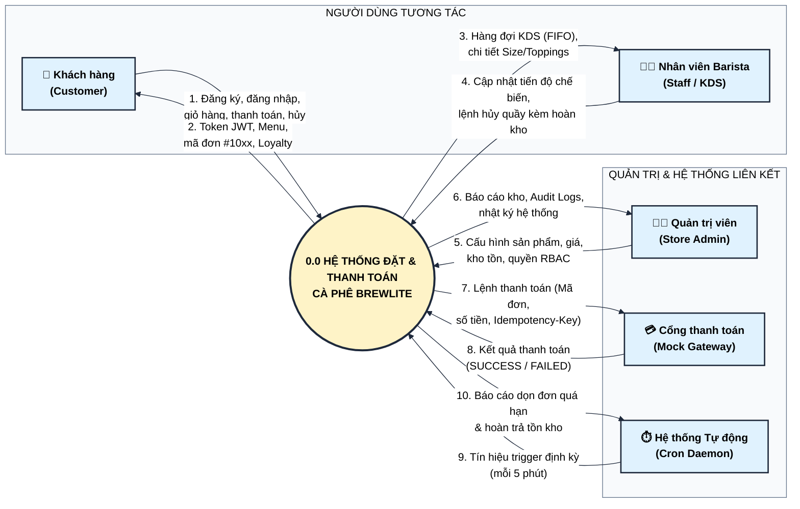

---

### 3.2 Bảng từ điển luồng dữ liệu mức ngữ cảnh

| ID Luồng | Tác nhân liên quan | Chiều | Các trường dữ liệu cốt lõi | Mục đích nghiệp vụ |
|---|---|---|---|---|
| **DF01.1** | Khách hàng | Vào -> Hệ thống | `email`, `password`, `items[{productId, size, toppings, qty}]`, `voucherCode`, `idempotencyKey`, `paymentMethod` | Gửi dữ liệu xác thực, lựa chọn món và lệnh thanh toán giao dịch. |
| **DF01.2** | Khách hàng | Ra <- Hệ thống | `accessToken`, `products[]`, `order{code, status, total, expiresAt}`, `paymentResult`, `loyaltyPoints` | Phản hồi thông tin menu, xác nhận đơn hàng thành công và số dư điểm thưởng. |
| **DF02.1** | Nhân viên Barista | Ra <- Hệ thống | `activeOrders[{code, createdAt, items[{productName, size, toppings, qty}], status}]` | Cung cấp danh sách hàng đợi các đơn đã thanh toán để quầy thực hiện pha chế. |
| **DF02.2** | Nhân viên Barista | Vào -> Hệ thống | `orderId`, `targetStatus ('PREPARING' \| 'READY' \| 'COMPLETED' \| 'CANCELLED')` | Gửi lệnh cập nhật trạng thái chế biến hoặc hủy đơn khi có sự cố tại quầy. |
| **DF03.1** | Quản trị viên | Vào -> Hệ thống | `productData{name, price, stock}`, `userRoleUpdate`, `queryFilters` | Quản lý danh mục thực đơn, số lượng tồn kho định mức và cấu hình quyền hạn. |
| **DF03.2** | Quản trị viên | Ra <- Hệ thống | `auditLogs[]`, `orderMetrics[]`, `inventoryStatus[]` | Hiển thị tình trạng hoạt động và số lượng sản phẩm tồn kho cho cấp quản trị. |
| **DF04.1** | Cổng thanh toán | Ra <- Hệ thống | `orderId`, `amount`, `paymentMethod`, `idempotencyKey` | Chuyển tiếp thông tin giao dịch để xử lý trừ tiền qua tài khoản ví/thẻ của khách. |
| **DF04.2** | Cổng thanh toán | Vào -> Hệ thống | `transactionStatus ('SUCCESS' \| 'FAILED')`, `gatewayRefId` | Trả về mã phản hồi xác nhận trạng thái thanh toán từ đối tác tài chính. |
| **DF05.1** | Cron Daemon | Vào -> Hệ thống | `cronTickEvent ('EVERY_5_MINUTES')`, `currentTime` | Phát tín hiệu thời gian định kỳ để đánh thức dịch vụ dọn dẹp đơn rác. |
| **DF05.2** | Cron Daemon | Ra <- Hệ thống | `cleanedOrdersCount`, `restockedItemsSummary[]` | Ghi nhận nhật ký (Log) số lượng đơn hàng hết hạn 15 phút đã được hủy và hoàn kho. |

---

## 4. DFD LV1 (DETAILED DATA FLOW DIAGRAM) — SƠ ĐỒ LUỒNG DỮ LIỆU MỨC 1

### 4.1 Sơ đồ luồng dữ liệu mức 1 phân rã chi tiết (Mermaid)

> **Tài nguyên biểu đồ:** [Mã nguồn Mermaid (.mmd)](./diagrams/dfd-lv1.mmd) &bull; [Ảnh Vector SVG phóng to 1.000%](./diagrams/svg/dfd-lv1.svg) &bull; Nhập vào Draw.io: `Ctrl + Shift + I`

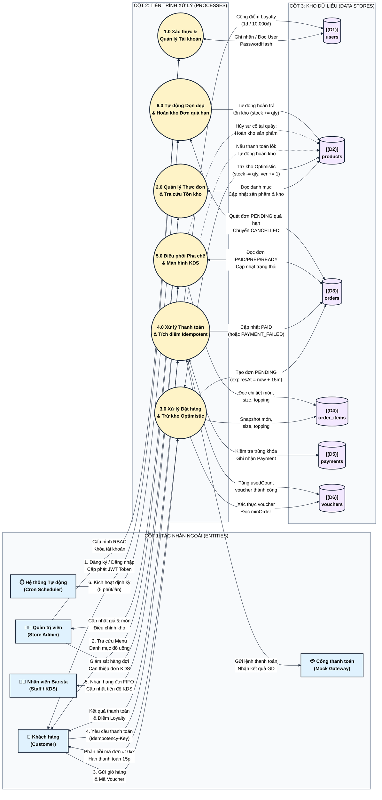

---

### 4.2 Bảng từ điển kho dữ liệu (Data Store Dictionary)

| Mã kho | Tên bảng CSDL vật lý | Mô tả mục đích lưu trữ | Thực thể chính liên kết | Tần suất đọc / ghi |
|---|---|---|---|---|
| **D1** | `users` | Lưu trữ tài khoản người dùng, phân quyền RBAC, mật khẩu băm, và tổng điểm thưởng tích lũy (Loyalty Points). | User | Đọc rất cao (mỗi request qua JWT Guard); Ghi trung bình (đăng ký mới, cộng điểm thưởng). |
| **D2** | `products` | Lưu trữ danh mục đồ uống, giá niêm yết cơ bản, số lượng tồn kho định mức, và phiên bản Optimistic Lock (`version`). | Product | Đọc cực cao (xem menu); Ghi cao (trừ kho khi đặt, hoàn kho khi hủy). |
| **D3** | `orders` | Quản lý vòng đời đơn hàng, mã đơn định dạng `#10xx`, tổng tiền, giảm giá, hạn thanh toán 15 phút (`expiresAt`), và trạng thái máy. | Order | Đọc rất cao (khách theo dõi, Barista theo dõi KDS); Ghi cao (tạo đơn, đổi trạng thái). |
| **D4** | `order_items` | Lưu snapshot cấu hình đồ uống tại thời điểm đặt (tên món, size S/M/L, mảng toppings JSON, đơn giá, số lượng, thành tiền). | OrderItem | Đọc cao (hiển thị chi tiết đơn, KDS pha chế); Ghi theo lô khi tạo đơn hàng. |
| **D5** | `payments` | Lưu trữ lịch sử giao dịch thanh toán không tiền mặt, khóa chống trùng lặp duy nhất `idempotencyKey`, số tiền và kết quả giao dịch. | Payment | Đọc trung bình (kiểm tra Idempotency Replay); Ghi trung bình (mỗi lần bấm thanh toán). |
| **D6** | `vouchers` | Lưu trữ các mã khuyến mãi giảm giá, điều kiện giá trị đơn tối thiểu (`minOrder`), hạn mức sử dụng và số lần đã áp dụng thực tế (`usedCount`). | Voucher | Đọc cao (kiểm tra voucher hợp lệ); Ghi thấp (tăng `usedCount` khi đơn thanh toán thành công). |

---

### 4.3 Bảng từ điển luồng dữ liệu chi tiết mức 1

| Mã luồng | Xuất phát | Đích đến | Cấu trúc dữ liệu chi tiết | Mô tả quy tắc xử lý |
|---|---|---|---|---|
| **F_P1_D1** | Tiến trình P1.0 | Kho D1 (`users`) | `{ id, email, passwordHash, role, loyaltyPoints, createdAt }` | Ghi nhận user mới hoặc truy vấn thông tin để xác thực mật khẩu bcrypt. |
| **F_P2_D2** | Kho D2 (`products`) | Tiến trình P2.0 | `{ id, name, price, description, imageUrl, stock, version }` | Truy xuất toàn bộ danh mục sản phẩm đang mở bán để hiển thị cho Client. |
| **F_P3_D6** | Tiến trình P3.0 | Kho D6 (`vouchers`) | `{ code, type, value, minOrder, usageLimit, usedCount, expiresAt }` | Kiểm tra điều kiện áp dụng voucher theo tổng tiền đơn và thời hạn hiệu lực. |
| **F_P3_D2** | Tiến trình P3.0 | Kho D2 (`products`) | `UPDATE products SET stock = stock - qty, version = version + 1 WHERE id = :id AND version = :ver AND stock >= :qty` | Trừ tồn kho an toàn bằng cơ chế Optimistic Locking chống race condition. |
| **F_P3_D3** | Tiến trình P3.0 | Kho D3 (`orders`) | `{ id, code, userId, status='PENDING', subtotal, discountAmount, total, expiresAt=now()+15m }` | Tạo bản ghi đơn hàng mới có thời hạn thanh toán giới hạn trong 15 phút. |
| **F_P3_D4** | Tiến trình P3.0 | Kho D4 (`order_items`) | `INSERT order_items (id, orderId, productId, productName, size, toppings, qty, unitPrice, lineTotal)` | Ghi nhận danh sách món đã chọn (đã tính giá phụ thuộc size & topping). |
| **F_P4_D5** | Tiến trình P4.0 | Kho D5 (`payments`) | `{ id, orderId, idempotencyKey, amount, method, status }` | Lưu kết quả giao dịch thanh toán; bắt lỗi `P2002` nếu phát hiện trùng lặp khóa. |
| **F_P4_D3** | Tiến trình P4.0 | Kho D3 (`orders`) | `UPDATE orders SET status = 'PAID' (hoặc 'PAYMENT_FAILED') WHERE id = :id` | Cập nhật trạng thái đơn hàng sau khi đối tác thanh toán trả về kết quả. |
| **F_P4_D1** | Tiến trình P4.0 | Kho D1 (`users`) | `UPDATE users SET loyaltyPoints = loyaltyPoints + floor(total / 10000) WHERE id = :userId` | Tích điểm thưởng thành viên tự động sau khi thanh toán thành công. |
| **F_P5_D3** | Tiến trình P5.0 | Kho D3 (`orders`) | `SELECT * FROM orders WHERE status IN ('PAID', 'PREPARING', 'READY') ORDER BY createdAt ASC` | Lấy danh sách hàng đợi theo nguyên tắc vào trước ra trước (FIFO) cho KDS. |
| **F_P5_UPD** | Tiến trình P5.0 | Kho D3 (`orders`) | `UPDATE orders SET status = :nextStatus WHERE id = :orderId` | Nhân viên Barista chuyển trạng thái qua từng nấc chế biến hoặc hủy đơn tại quầy. |
| **F_P6_D3** | Tiến trình P6.0 | Kho D3 (`orders`) | `SELECT * FROM orders WHERE status = 'PENDING' AND expiresAt < now()` | Quét tìm các đơn hàng bị bỏ rơi quá 15 phút để kích hoạt hủy tự động. |
| **F_P6_D2** | Tiến trình P6.0 | Kho D2 (`products`) | `UPDATE products SET stock = stock + item.qty, version = version + 1 WHERE id = item.productId` | Tự động hoàn trả số lượng nguyên liệu/ly vào kho sau khi đơn bị hủy. |
| **F_ADMIN_P1**| Quản trị viên | Tiến trình P1.0 | `{ userId, role: 'CUSTOMER' \| 'STAFF' \| 'ADMIN' }` | Quản trị viên cấu hình phân quyền hoặc khóa/mở tài khoản người dùng. |
| **F_ADMIN_P2**| Quản trị viên | Tiến trình P2.0 | `{ id, name, price, description, imageUrl, stock }` | Quản trị viên cập nhật thông tin sản phẩm và điều chỉnh số lượng tồn kho thực tế. |
| **F_P4_GW** | Tiến trình P4.0 | Cổng thanh toán | `{ orderId, amount, paymentMethod, idempotencyKey }` | Chuyển tiếp yêu cầu thanh toán không tiền mặt sang cổng đối tác (Mock Gateway). |
| **F_GW_P4** | Cổng thanh toán | Tiến trình P4.0 | `{ transactionStatus: 'SUCCESS' \| 'FAILED', gatewayRefId }` | Cổng đối tác trả về kết quả xác thực giao dịch để hệ thống hoàn tất thanh toán. |
| **F_ADMIN_P5**| Quản trị viên | Tiến trình P5.0 | `{ orderId, action: 'CANCEL_FORCE', reason }` | Quản trị viên giám sát hàng đợi KDS và can thiệp xử lý hủy đơn khẩn cấp khi gặp sự cố. |

---

## 5. USE CASE DIAGRAM & ĐẶC TẢ KỊCH BẢN USE CASE CHUẨN ACADEMIC

### 5.1 Sơ đồ Use Case tổng quan tinh gọn (Overview — 4 Actors, 5 Packages)

Sơ đồ tổng quan cấp cao kết nối 4 tác nhân chính tới 5 phân hệ chức năng cốt lõi của BrewLite, loại bỏ hiện tượng rối dây phức tạp và tạo góc nhìn phân rã rõ ràng theo từng miền nghiệp vụ:

> **Tài nguyên biểu đồ:** [Mã nguồn Mermaid (.mmd)](./diagrams/usecase-overview.mmd) &bull; [Ảnh Vector SVG phóng to 1.000%](./diagrams/svg/usecase-overview.svg) &bull; Nhập vào Draw.io: `Ctrl + Shift + I`

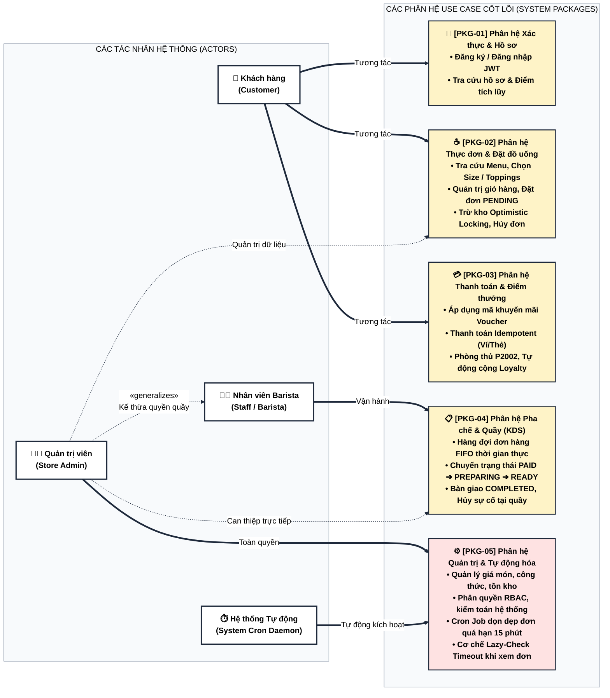

---

### 5.2 Sơ đồ Use Case phân rã chi tiết — Khách hàng (Customer Use Cases)

Biểu đồ tập trung toàn bộ hành trình tương tác của khách hàng từ khi xem món, tùy biến, áp mã voucher, khởi tạo đơn (kèm trừ kho Optimistic Locking), thanh toán Idempotent đến khi tích điểm Loyalty hoặc hủy đơn:

> **Tài nguyên biểu đồ:** [Mã nguồn Mermaid (.mmd)](./diagrams/usecase-customer.mmd) &bull; [Ảnh Vector SVG phóng to 1.000%](./diagrams/svg/usecase-customer.svg) &bull; Nhập vào Draw.io: `Ctrl + Shift + I`

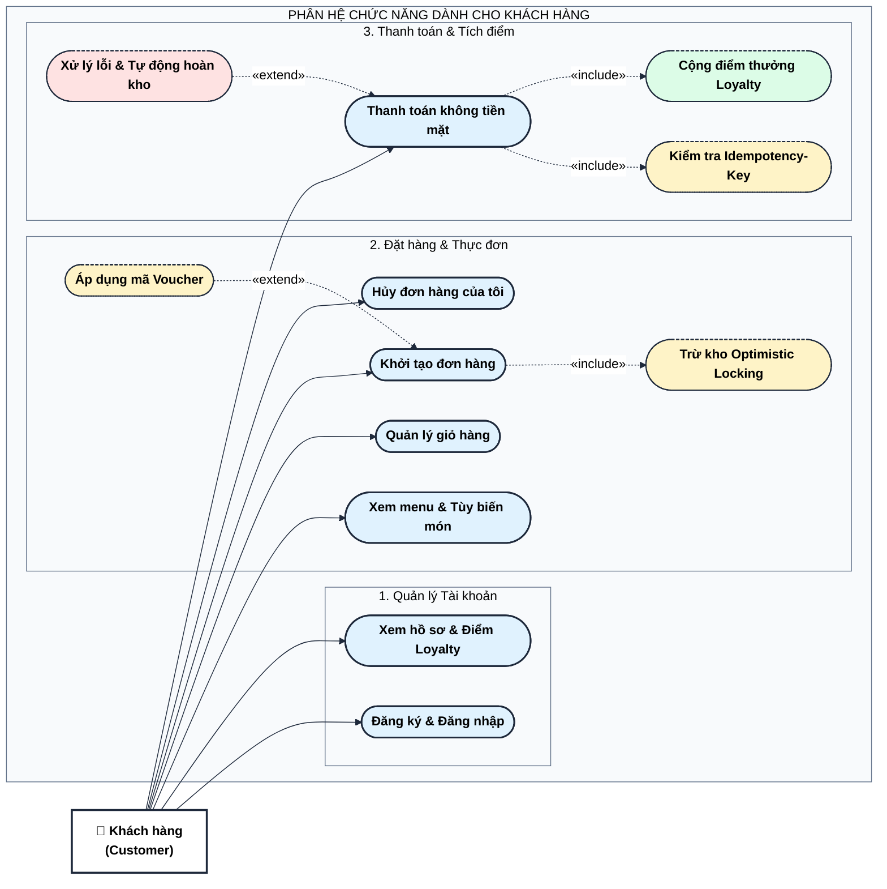

---

### 5.3 Sơ đồ Use Case phân rã chi tiết — Nhân viên Barista (Staff / KDS Use Cases)

Biểu đồ đặc tả quy trình vận hành tại quầy pha chế thông qua hệ thống hiển thị bếp (KDS), bao gồm quản lý hàng đợi FIFO, điều phối nấc pha chế và xử lý hủy đơn sự cố kèm hoàn kho tự động:

> **Tài nguyên biểu đồ:** [Mã nguồn Mermaid (.mmd)](./diagrams/usecase-staff.mmd) &bull; [Ảnh Vector SVG phóng to 1.000%](./diagrams/svg/usecase-staff.svg) &bull; Nhập vào Draw.io: `Ctrl + Shift + I`

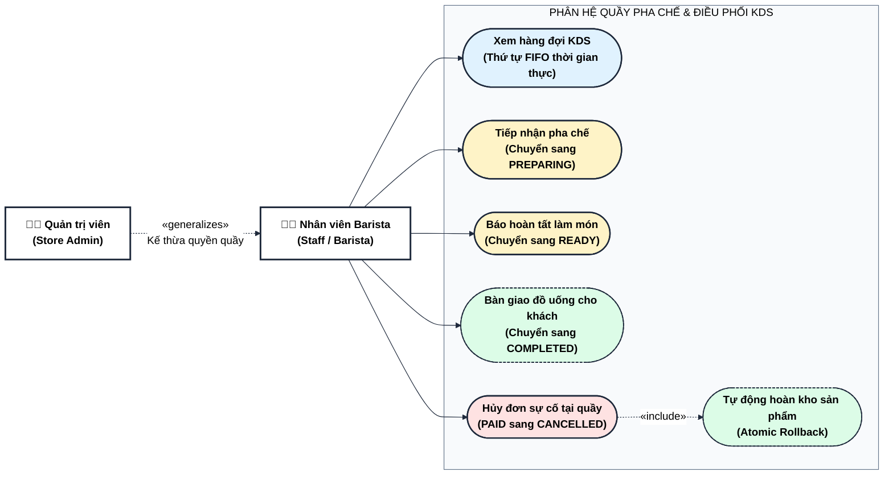

---

### 5.4 Sơ đồ Use Case phân rã chi tiết — Quản trị viên & Tự động hóa (Admin & System Cron)

Biểu đồ đặc tả các tác vụ đặc quyền quản trị danh mục/kho/người dùng cùng 2 cơ chế tự động hóa dọn dẹp đơn quá hạn 15 phút (Cron Daemon 5 phút/lần & Lazy-Check Timeout khi xem đơn):

> **Tài nguyên biểu đồ:** [Mã nguồn Mermaid (.mmd)](./diagrams/usecase-admin-cron.mmd) &bull; [Ảnh Vector SVG phóng to 1.000%](./diagrams/svg/usecase-admin-cron.svg) &bull; Nhập vào Draw.io: `Ctrl + Shift + I`

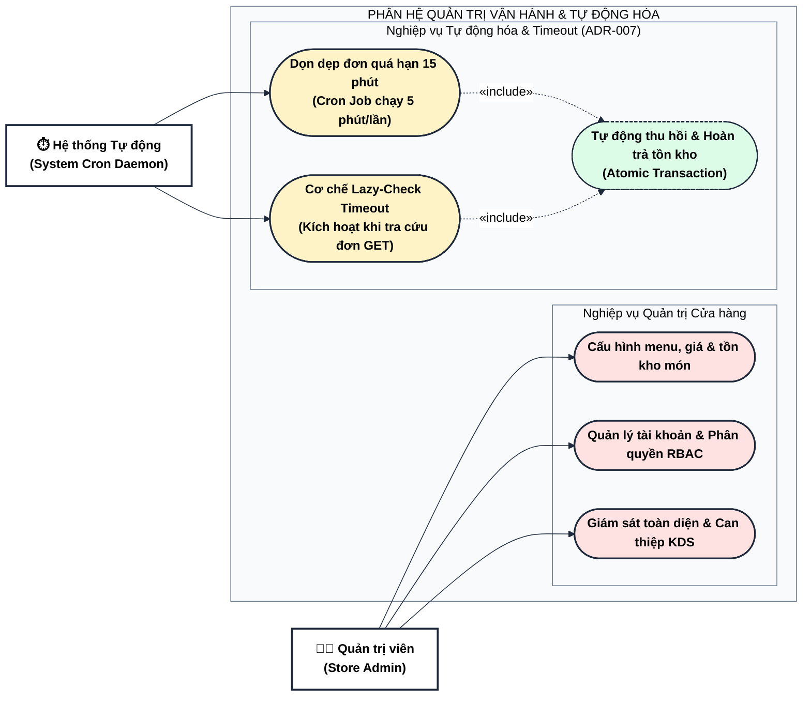

### 5.5 Đặc tả Use Case UC-01: Đặt đồ uống & Áp mã Voucher

| Mục đặc tả | Nội dung chi tiết |
|---|---|
| **Mã Use Case** | **UC-01** |
| **Tên Use Case** | **Đặt đồ uống và áp dụng mã khuyến mãi (Place Order with Voucher)** |
| **Tác nhân chính (Primary Actor)** | Khách hàng đã đăng nhập (`Customer`) |
| **Tác nhân phụ (Supporting Actors)** | Cơ sở dữ liệu PostgreSQL (Transaction Engine), Vouchers Service |
| **Mô tả tóm tắt (Brief Description)** | Khách hàng chuyển các món trong giỏ hàng thành đơn hàng chính thức ở trạng thái `PENDING`. Hệ thống xác thực giá tiền, kiểm tra điều kiện mã voucher, thực hiện trừ kho có điều kiện (Optimistic Locking) và thiết lập thời hạn thanh toán 15 phút. |
| **Điều kiện tiên quyết (Pre-conditions)** | 1. Khách hàng đã xác thực và có JWT hợp lệ. 2. Giỏ hàng có ít nhất một sản phẩm hợp lệ. 3. Số lượng sản phẩm yêu cầu không vượt quá số lượng tồn kho hiện hành. |
| **Điều kiện sau thành công (Post-conditions)** | 1. Bản ghi `Order` được tạo với trạng thái `PENDING`, mã định danh duy nhất `#10xx`, `expiresAt = now() + 15m`. 2. Các bản ghi `OrderItem` được lưu lại với thông tin snapshot (tên, size, topping, giá). 3. Số lượng tồn kho `Product.stock` bị giảm tương ứng và `version` tăng thêm 1. 4. Client nhận được thông tin đơn và chuyển sang trang thanh toán. |
| **Luồng sự kiện chính (Main Flow / Happy Path)** | 1. Khách hàng truy cập màn hình Giỏ hàng, nhập mã Voucher (tùy chọn) và bấm nút **"Tiến hành đặt hàng"**. 2. Frontend gửi request `POST /api/orders` kèm token Bearer và payload chứa mảng `items` và `voucherCode`. 3. Backend truy vấn CSDL để lấy giá gốc và phiên bản tồn kho hiện hành của các sản phẩm (`Product.version`). 4. Backend tính toán đơn giá từng món theo công thức `calculateItemUnitPrice(price, size, toppings)` và tính tổng phụ `subtotal`. 5. Nếu có `voucherCode`: Backend gọi `VouchersService.validateVoucher()` để kiểm tra ngày hết hạn, hạn mức `usageLimit` và điều kiện `minOrder`. Tính số tiền chiết khấu `discountAmount`. 6. Backend tính tổng tiền cuối cùng: `total = max(0, subtotal - discountAmount)`. 7. Backend mở Database Transaction `$transaction`: &emsp;a. Chạy lệnh cập nhật tồn kho có điều kiện cho từng sản phẩm: `UPDATE products SET stock = stock - qty, version = version + 1 WHERE id = :id AND version = :ver AND stock >= :qty`. &emsp;b. Kiểm tra số dòng cập nhật (`count > 0`). &emsp;c. Đếm số đơn để sinh mã tự tăng dạng `#1042`. &emsp;d. Thiết lập `expiresAt = new Date(Date.now() + 15 * 60 * 1000)`. &emsp;e. Tạo bản ghi `Order` và mảng quan hệ `items` (`OrderItem`). 8. Database Transaction commit thành công. 9. Backend trả về HTTP `201 Created` kèm thực thể Order hoàn chỉnh. 10. Frontend nhận kết quả, xóa giỏ hàng và điều hướng khách sang trang chi tiết đơn hàng `/orders/[id]` có đồng hồ đếm ngược 15 phút. |
| **Luồng ngoại lệ / Rẽ nhánh (Alternative / Exception Flows)** | **A1. Mã Voucher không hợp lệ hoặc hết hạn:** - Tại bước 5, nếu mã không tồn tại, hết hạn, hoặc `subtotal < minOrder` -> Ném `BadRequestException` ("Voucher không tồn tại hoặc không đủ điều kiện"). Client nhận mã lỗi HTTP 400 và yêu cầu khách đổi mã hoặc tiếp tục không voucher. **A2. Sản phẩm hết hàng (Out of Stock):** - Tại bước 3, nếu `product.stock < item.qty` -> Ném `ConflictException` (HTTP 409: "Sản phẩm không đủ số lượng tồn kho"). Transaction không được thực hiện. **A3. Xung đột phiên bản tồn kho (Optimistic Lock Conflict):** - Tại bước 7.b, nếu `updateResult.count === 0` (do có khách hàng khác đặt cùng lúc làm thay đổi `version`) -> Transaction tự động rollback! Ném `ConflictException` (HTTP 409: "Sản phẩm đã có thay đổi tồn kho hoặc vừa hết hàng. Vui lòng thử lại"). Không có dữ liệu rác được ghi vào DB. |
| **Yêu cầu phi chức năng (NFR)** | - Thời gian xử lý transaction đặt hàng và trừ kho phải < 200ms. - Đảm bảo tính toàn vẹn ACID, không bao giờ xảy ra hiện tượng âm kho (stock < 0). |

---

### 5.6 Đặc tả Use Case UC-02: Thanh toán không tiền mặt Idempotent

| Mục đặc tả | Nội dung chi tiết |
|---|---|
| **Mã Use Case** | **UC-02** |
| **Tên Use Case** | **Xử lý thanh toán không tiền mặt Idempotent (Process Payment with Idempotency)** |
| **Tác nhân chính (Primary Actor)** | Khách hàng sở hữu đơn hàng (`Customer`) |
| **Tác nhân phụ (Supporting Actors)** | Cổng thanh toán giả lập (Mock Payment Gateway), Order State Machine Engine |
| **Mô tả tóm tắt (Brief Description)** | Khách hàng thực hiện thanh toán cho đơn hàng `PENDING` hoặc `PAYMENT_FAILED` bằng Ví điện tử hoặc Thẻ ngân hàng. Hệ thống sử dụng khóa `Idempotency-Key` để ngăn chặn trừ tiền lặp lại, tích điểm thưởng Loyalty và chuyển đơn sang trạng thái `PAID`. |
| **Điều kiện tiên quyết (Pre-conditions)** | 1. Đơn hàng tồn tại, thuộc quyền sở hữu của User đang đăng nhập. 2. Trạng thái đơn hàng hiện tại là `PENDING` hoặc `PAYMENT_FAILED`. 3. Request gửi lên bắt buộc phải có Header `Idempotency-Key` (chuỗi UUID). |
| **Điều kiện sau thành công (Post-conditions)** | 1. Bản ghi `Payment` mới được tạo với trạng thái `SUCCESS`. 2. Trạng thái `Order.status` chuyển thành `PAID`. 3. Nếu đơn có áp dụng voucher: `Voucher.usedCount` tăng 1. 4. Tài khoản khách hàng được cộng điểm Loyalty: `+1 điểm / mỗi 10.000đ` giá trị thanh toán. 5. Màn hình thanh toán hiển thị thông báo thành công và mã nhận đồ uống tại quầy. |
| **Luồng sự kiện chính (Main Flow / Happy Path)** | 1. Khách hàng lựa chọn phương thức thanh toán (`E_WALLET` hoặc `BANK_CARD`) tại trang `/orders/[id]` và bấm **"Xác nhận thanh toán"**. 2. Frontend sinh khóa UUID ngẫu nhiên (`crypto.randomUUID()`), vô hiệu hóa nút bấm trong 3 giây để chống double-click, gửi request `POST /api/payments` kèm Header `Idempotency-Key: <UUID>` và body `{ orderId, method }`. 3. Backend kiểm tra Header: nếu rỗng ném `BadRequestException` (HTTP 400). 4. Backend truy vấn bảng `payments` theo `idempotencyKey` để kiểm tra trùng lặp. 5. Không tìm thấy khóa trùng -> Backend truy vấn đơn hàng, xác minh quyền sở hữu (`order.userId === userId`). 6. Backend gọi `assertTransition(order.status, OrderStatus.PAID)` của máy trạng thái để đảm bảo việc chuyển đổi hợp lệ. 7. Backend mở Database Transaction `$transaction`: &emsp;a. Tạo bản ghi `Payment` với `status = SUCCESS`, phương thức đã chọn và `idempotencyKey`. &emsp;b. Cập nhật `Order.status = PAID`. &emsp;c. Nếu `order.voucherCode` tồn tại: tăng `Voucher.usedCount` thêm 1. &emsp;d. Tính điểm thưởng: `pointsEarned = Math.floor(order.total / 10000)`. Nếu > 0, cập nhật `User.loyaltyPoints += pointsEarned`. 8. Commit Transaction thành công. 9. Backend trả về phản hồi HTTP `200 OK` chứa mã đơn, trạng thái `PAID` và số điểm thưởng vừa tích lũy. 10. Frontend chuyển giao diện sang trạng thái hiển thị mã nhận món tại quầy. |
| **Luồng ngoại lệ / Rẽ nhánh (Alternative / Exception Flows)** | **A1. Tái kích hoạt khóa Idempotent (Idempotent Replay):** - Tại bước 4, nếu tìm thấy bản ghi `Payment` trùng khóa VÀ cùng `orderId` -> Backend KHÔNG thực hiện trừ tiền lại hay cập nhật lại DB. Thay vào đó, trả về ngay lập tức dữ liệu cũ với flag `idempotentReplay: true` (HTTP 200). Đảm bảo giao dịch idempotent an toàn. **A2. Xung đột tái sử dụng khóa cho đơn khác (Key Reuse Across Orders):** - Tại bước 4, nếu tìm thấy `Payment` trùng khóa NHƯNG khác `orderId` -> Ném `UnprocessableEntityException` (HTTP 422: "Idempotency-Key đã được sử dụng cho một đơn hàng khác"). **A3. Lỗi Race Condition mức CSDL (Prisma P2002 Race Defense):** - Nếu 2 request song song lọt qua bước 4 cùng lúc, Database sẽ chặn request thứ 2 thông qua ràng buộc `@unique` trên `idempotencyKey` và ném mã lỗi `P2002`. Khối `catch` của Backend bắt lỗi này, truy vấn lại bản ghi thanh toán đã được tạo bởi request thứ nhất và trả về kết quả thành công mà không gây crash hệ thống. **A4. Giả lập thanh toán thất bại (Simulated Payment Failure - Task 8 & 10):** - Nếu request gửi cờ `forceFail: true` (hoặc đối tác báo lỗi thẻ) -> Trong transaction, Backend tạo `Payment` trạng thái `FAILED`, chuyển `Order.status = PAYMENT_FAILED` và **tự động hoàn trả tồn kho sản phẩm** (`stock += qty, version += 1`). Khách hàng có thể bấm "Thử lại" hoặc "Hủy đơn". |
| **Yêu cầu phi chức năng (NFR)** | - Tuyệt đối không xảy ra tình trạng khách bị trừ tiền 2 lần cho cùng một giao dịch. - Thao tác hoàn kho khi lỗi thanh toán phải diễn ra trong cùng 1 Transaction nguyên tử (Atomic). |

---

### 5.7 Đặc tả Use Case UC-03: Barista tiếp nhận & Cập nhật chế biến đơn tại KDS

| Mục đặc tả | Nội dung chi tiết |
|---|---|
| **Mã Use Case** | **UC-03** |
| **Tên Use Case** | **Barista tiếp nhận và điều phối chế biến đơn hàng (KDS Order Fulfillment)** |
| **Tác nhân chính (Primary Actor)** | Nhân viên pha chế (`Staff / Barista`) |
| **Tác nhân phụ (Supporting Actors)** | Quản trị viên (`Admin`), Order State Machine Engine |
| **Mô tả tóm tắt (Brief Description)** | Nhân viên pha chế sử dụng màn hình hiển thị quầy (Kitchen Display System - KDS) để theo dõi các đơn hàng đã thanh toán thành công theo thứ tự thời gian (FIFO), tiếp nhận làm món, thông báo món đã sẵn sàng và hoàn tất bàn giao cho khách hàng. |
| **Điều kiện tiên quyết (Pre-conditions)** | 1. Nhân viên đã đăng nhập tài khoản có vai trò `STAFF` hoặc `ADMIN`. 2. Đơn hàng hiển thị trên KDS phải ở một trong ba trạng thái hợp lệ: `PAID`, `PREPARING`, hoặc `READY`. |
| **Điều kiện sau thành công (Post-conditions)** | 1. Trạng thái đơn hàng được cập nhật tuần tự: `PAID -> PREPARING -> READY -> COMPLETED`. 2. Khi chuyển `COMPLETED`, đơn hàng kết thúc vòng đời và biến mất khỏi danh sách chờ của KDS. |
| **Luồng sự kiện chính (Main Flow / Happy Path)** | 1. Nhân viên truy cập trang `/staff` (được bảo vệ bởi Guard xác thực Role). 2. Frontend tự động gọi API `GET /api/orders/staff/active` lấy danh sách đơn cần xử lý sắp xếp tăng dần theo `createdAt` (FIFO). 3. Barista nhìn thấy thẻ đơn hàng mới ở trạng thái `PAID` kèm chi tiết kích thước (Size S/M/L) và danh sách Topping. 4. Barista chuẩn bị nguyên liệu và bấm nút **"Bắt đầu pha chế"**. 5. Frontend gửi request `PATCH /api/orders/:id/status` với body `{ status: 'PREPARING' }`. 6. Backend gọi `assertTransition(OrderStatus.PAID, OrderStatus.PREPARING)` -> Hợp lệ. 7. Backend cập nhật `Order.status = PREPARING` trong DB và trả về kết quả thành công. 8. Sau khi pha chế xong, Barista đóng nắp ly, dán tem nhãn và bấm nút **"Đã pha xong (Sẵn sàng)"**. 9. Frontend gửi `PATCH /api/orders/:id/status` với body `{ status: 'READY' }`. Backend kiểm tra `assertTransition(PREPARING, READY)` và cập nhật DB. 10. Khách hàng tới quầy xuất trình mã đơn `#10xx`, Barista đối chiếu món đồ uống và bấm **"Hoàn tất giao hàng"**. 11. Frontend gửi `PATCH /api/orders/:id/status` với body `{ status: 'COMPLETED' }`. Backend cập nhật đơn sang trạng thái kết thúc `COMPLETED`. Thẻ đơn được đóng lại. |
| **Luồng ngoại lệ / Rẽ nhánh (Alternative / Exception Flows)** | **A1. Hủy đơn tại quầy do sự cố nguyên liệu (Staff Cancellation):** - Nếu đơn hàng ở trạng thái `PAID` nhưng quầy gặp sự cố (ví dụ: máy xay hỏng hoặc hết sữa tươi đột ngột), Staff bấm nút "Hủy đơn sự cố". Backend kiểm tra quyền Staff, gọi `assertTransition(PAID, CANCELLED)` và mở transaction chuyển đơn sang `CANCELLED` đồng thời hoàn kho lại toàn bộ sản phẩm. **A2. Vi phạm thứ tự chuyển trạng thái máy:** - Nếu Barista bấm nhầm nút hoặc gửi request nhảy cóc (ví dụ: từ `PAID` nhảy thẳng lên `COMPLETED`), hàm `assertTransition` sẽ phát hiện vi phạm ma trận chuyển đổi và ném lỗi `BadRequestException` (HTTP 400: "Chuyển đổi trạng thái không hợp lệ: Không thể chuyển từ [PAID] sang [COMPLETED]"). |
| **Yêu cầu phi chức năng (NFR)** | - Màn hình KDS phải cập nhật mượt mà, trực quan, phân biệt rõ ràng màu sắc trạng thái (Vàng: PAID, Cam: PREPARING, Xanh lá: READY). |

---

## 6. ERD (ENTITY-RELATIONSHIP DIAGRAM) & DATA DICTIONARY

### 6.1 Sơ đồ quan hệ thực thể chuẩn hóa (Mermaid)

Sơ đồ quan hệ thực thể dưới đây được thiết kế và ánh xạ **chính xác 100%** theo định nghĩa lược đồ dữ liệu `apps/backend/prisma/schema.prisma` của dự án BrewLite:

> **Tài nguyên biểu đồ:** [Mã nguồn Mermaid (.mmd)](./diagrams/erd.mmd) &bull; [Ảnh Vector SVG phóng to 1.000%](./diagrams/svg/erd.svg) &bull; Nhập vào Draw.io: `Ctrl + Shift + I`

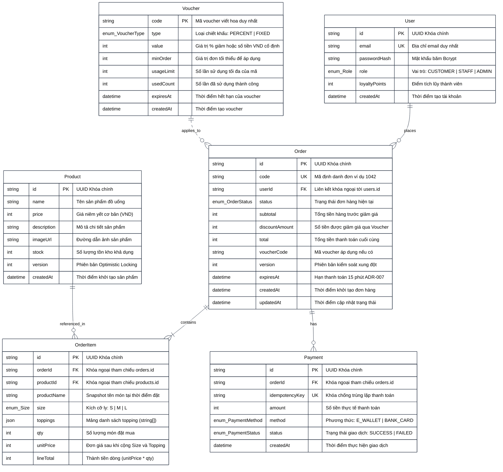

---

### 6.2 Bảng từ điển dữ liệu (Data Dictionary khớp 100% Prisma Schema)

#### Bảng 1: `users` (Thông tin người dùng & Phân quyền)
| Tên cột | Kiểu dữ liệu (Prisma / SQL) | Khóa | Ràng buộc | Giá trị mặc định | Diễn giải nghiệp vụ |
|---|---|---|---|---|---|
| `id` | `String` (UUID) | **PK** | NOT NULL | `uuid()` | Khóa chính định danh tài khoản duy nhất. |
| `email` | `String` (VARCHAR) | **UK** | NOT NULL, UNIQUE | None | Địa chỉ thư điện tử dùng để đăng nhập. |
| `passwordHash` | `String` (VARCHAR) | None | NOT NULL | None | Chuỗi mật khẩu đã băm an toàn qua bcryptjs (salt 10). |
| `role` | `Enum (Role)` | None | NOT NULL | `CUSTOMER` | Vai trò trong hệ thống: `CUSTOMER`, `STAFF`, `ADMIN`. |
| `loyaltyPoints` | `Int` (INTEGER) | None | NOT NULL | `0` | Tổng số điểm thưởng tích lũy (1 điểm / 10.000đ đơn hàng). |
| `createdAt` | `DateTime` (TIMESTAMPTZ) | None | NOT NULL | `now()` | Dấu mốc thời gian đăng ký tài khoản. |

#### Bảng 2: `products` (Danh mục sản phẩm & Tồn kho)
| Tên cột | Kiểu dữ liệu (Prisma / SQL) | Khóa | Ràng buộc | Giá trị mặc định | Diễn giải nghiệp vụ |
|---|---|---|---|---|---|
| `id` | `String` (UUID) | **PK** | NOT NULL | `uuid()` | Khóa chính định danh sản phẩm đồ uống. |
| `name` | `String` (VARCHAR) | None | NOT NULL | None | Tên thương mại của đồ uống (Cà phê sữa, Latte...). |
| `price` | `Int` (INTEGER) | None | NOT NULL | None | Giá niêm yết cơ bản cho kích cỡ nhỏ nhất Size S (VND). |
| `description` | `String` (TEXT) | None | NOT NULL | None | Mô tả thành phần, hương vị của đồ uống. |
| `imageUrl` | `String` (VARCHAR) | None | NOT NULL | None | Đường dẫn hình ảnh minh họa món nước. |
| `stock` | `Int` (INTEGER) | None | NOT NULL | `100` | Số lượng ly/phần hiện có trong kho nguyên liệu. |
| `version` | `Int` (INTEGER) | None | NOT NULL | `0` | Số phiên bản phục vụ Optimistic Locking chống bán vượt kho. |
| `createdAt` | `DateTime` (TIMESTAMPTZ) | None | NOT NULL | `now()` | Thời điểm khởi tạo món đồ uống trên hệ thống. |

#### Bảng 3: `orders` (Quản lý Đơn hàng)
| Tên cột | Kiểu dữ liệu (Prisma / SQL) | Khóa | Ràng buộc | Giá trị mặc định | Diễn giải nghiệp vụ |
|---|---|---|---|---|---|
| `id` | `String` (UUID) | **PK** | NOT NULL | `uuid()` | Khóa chính định danh đơn hàng nội bộ. |
| `code` | `String` (VARCHAR) | **UK** | NOT NULL, UNIQUE | None | Mã đơn hàng thân thiện hiển thị cho khách và quầy (ví dụ: `#1042`). |
| `userId` | `String` (UUID) | **FK** | NOT NULL | None | Khóa ngoại tham chiếu đến `users(id)` (OnDelete: Cascade). |
| `status` | `Enum (OrderStatus)` | None | NOT NULL | `PENDING` | Trạng thái hiện tại trong vòng đời đơn hàng. |
| `subtotal` | `Int` (INTEGER) | None | NOT NULL | None | Tổng giá trị các món trước khi áp dụng chiết khấu (VND). |
| `discountAmount`| `Int` (INTEGER) | None | NOT NULL | `0` | Số tiền được giảm giá trực tiếp từ Voucher (VND). |
| `total` | `Int` (INTEGER) | None | NOT NULL | None | Tổng số tiền thực tế khách hàng phải trả (`subtotal - discountAmount`). |
| `voucherCode` | `String` (VARCHAR) | None | NULLABLE | NULL | Mã voucher áp dụng cho đơn (nếu có). |
| `version` | `Int` (INTEGER) | None | NOT NULL | `0` | Phiên bản phục vụ kiểm soát xung đột dữ liệu đơn. |
| `expiresAt` | `DateTime` (TIMESTAMPTZ) | None | NULLABLE | NULL | Hạn thanh toán 15 phút cho đơn `PENDING` theo quy định ADR-007. |
| `createdAt` | `DateTime` (TIMESTAMPTZ) | None | NOT NULL | `now()` | Dấu mốc thời gian tạo đơn hàng. |
| `updatedAt` | `DateTime` (TIMESTAMPTZ) | None | NOT NULL | `@updatedAt` | Thời điểm cập nhật trạng thái gần nhất. |

#### Bảng 4: `order_items` (Chi tiết từng món trong Đơn)
| Tên cột | Kiểu dữ liệu (Prisma / SQL) | Khóa | Ràng buộc | Giá trị mặc định | Diễn giải nghiệp vụ |
|---|---|---|---|---|---|
| `id` | `String` (UUID) | **PK** | NOT NULL | `uuid()` | Khóa chính dòng chi tiết đơn hàng. |
| `orderId` | `String` (UUID) | **FK** | NOT NULL | None | Khóa ngoại liên kết `orders(id)` (OnDelete: Cascade). |
| `productId` | `String` (UUID) | **FK** | NOT NULL | None | Khóa ngoại liên kết `products(id)` (OnDelete: Restrict). |
| `productName` | `String` (VARCHAR) | None | NOT NULL | None | Snapshot tên món tại thời điểm mua (bảo vệ lịch sử khi đổi tên món). |
| `size` | `Enum (Size)` | None | NOT NULL | `S` | Kích cỡ đồ uống đã chọn: `S`, `M`, `L`. |
| `toppings` | `Json` (JSONB) | None | NULLABLE | NULL | Danh sách tên các topping đính kèm (mảng JSON các string). |
| `qty` | `Int` (INTEGER) | None | NOT NULL | `1` | Số lượng phần đồ uống đặt mua. |
| `unitPrice` | `Int` (INTEGER) | None | NOT NULL | None | Đơn giá của 1 ly sau khi cộng phụ thu Size và Topping (VND). |
| `lineTotal` | `Int` (INTEGER) | None | NOT NULL | None | Thành tiền của dòng chi tiết (`unitPrice * qty`). |

#### Bảng 5: `payments` (Lịch sử Giao dịch Thanh toán)
| Tên cột | Kiểu dữ liệu (Prisma / SQL) | Khóa | Ràng buộc | Giá trị mặc định | Diễn giải nghiệp vụ |
|---|---|---|---|---|---|
| `id` | `String` (UUID) | **PK** | NOT NULL | `uuid()` | Khóa chính của bản ghi giao dịch thanh toán. |
| `orderId` | `String` (UUID) | **FK** | NOT NULL | None | Khóa ngoại tham chiếu `orders(id)` (OnDelete: Cascade). |
| `idempotencyKey`| `String` (VARCHAR) | **UK** | NOT NULL, UNIQUE | None | Khóa duy nhất (UUID) chống trùng lặp yêu cầu thanh toán. |
| `amount` | `Int` (INTEGER) | None | NOT NULL | None | Số tiền đã thanh toán trong giao dịch (VND). |
| `method` | `Enum (PaymentMethod)`| None| NOT NULL | None | Phương thức thanh toán: `E_WALLET`, `BANK_CARD`. |
| `status` | `Enum (PaymentStatus)`| None| NOT NULL | None | Kết quả giao dịch: `SUCCESS` hoặc `FAILED`. |
| `createdAt` | `DateTime` (TIMESTAMPTZ) | None | NOT NULL | `now()` | Thời điểm ghi nhận giao dịch thanh toán. |

#### Bảng 6: `vouchers` (Chương trình Khuyến mãi & Giảm giá)
| Tên cột | Kiểu dữ liệu (Prisma / SQL) | Khóa | Ràng buộc | Giá trị mặc định | Diễn giải nghiệp vụ |
|---|---|---|---|---|---|
| `code` | `String` (VARCHAR) | **PK, UK**| NOT NULL, UNIQUE | None | Mã voucher viết hoa (ví dụ: `CHAOBANMOI`, `BREW10`). |
| `type` | `Enum (VoucherType)` | None | NOT NULL | None | Cơ chế giảm giá: `PERCENT` (% giá trị) hoặc `FIXED` (tiền mặt). |
| `value` | `Int` (INTEGER) | None | NOT NULL | None | Giá trị giảm (% nếu là PERCENT, số tiền VND nếu là FIXED). |
| `minOrder` | `Int` (INTEGER) | None | NOT NULL | `0` | Giá trị đơn hàng tối thiểu (`subtotal`) để được áp dụng mã. |
| `usageLimit` | `Int` (INTEGER) | None | NULLABLE | NULL | Tổng số lượt cho phép sử dụng mã trên toàn hệ thống. |
| `usedCount` | `Int` (INTEGER) | None | NOT NULL | `0` | Số lượt mã đã được áp dụng thành công vào các đơn `PAID`. |
| `expiresAt` | `DateTime` (TIMESTAMPTZ) | None | NULLABLE | NULL | Ngày giờ hết hạn sử dụng của mã khuyến mãi. |
| `createdAt` | `DateTime` (TIMESTAMPTZ) | None | NOT NULL | `now()` | Thời điểm mã voucher được ban hành. |

---

### 6.3 Định nghĩa các kiểu liệt kê (Enumerations)

- **`Role`:**
  - `CUSTOMER`: Khách hàng thông thường, có quyền đặt hàng, thanh toán, xem đơn cá nhân và tích điểm.
  - `STAFF`: Nhân viên quầy pha chế, có quyền truy cập KDS, cập nhật trạng thái làm món và hủy đơn PAID khi có sự cố.
  - `ADMIN`: Quản trị viên cao nhất, có toàn quyền trên toàn bộ hệ thống và quản trị dữ liệu.
- **`OrderStatus`:**
  - `PENDING`: Đơn mới tạo, giữ kho tạm thời trong 15 phút chờ thanh toán.
  - `PAID`: Đã thanh toán thành công, chờ Barista tiếp nhận.
  - `PREPARING`: Đang trong quá trình pha chế tại quầy.
  - `READY`: Món nước đã hoàn thành, sẵn sàng phục vụ tại quầy.
  - `COMPLETED`: Đã bàn giao cho khách (Trạng thái kết thúc).
  - `PAYMENT_FAILED`: Thanh toán không thành công, tạm giữ đơn chờ thử lại hoặc hủy.
  - `CANCELLED`: Đã hủy đơn và hoàn trả số lượng vào tồn kho (Trạng thái kết thúc).
- **`Size`:** `S` (Nhỏ - Tiêu chuẩn), `M` (Vừa - Phụ thu +5.000đ), `L` (Lớn - Phụ thu +10.000đ).
- **`PaymentMethod`:** `E_WALLET` (Ví điện tử MoMo/ZaloPay), `BANK_CARD` (Thẻ ngân hàng Napas/Visa/Mastercard).
- **`PaymentStatus`:** `SUCCESS` (Thành công), `FAILED` (Thất bại).
- **`VoucherType`:** `PERCENT` (Giảm theo %), `FIXED` (Giảm số tiền cố định).

---

## 7. SEQUENCE DIAGRAMS — SƠ ĐỒ TUẦN TỰ CHO CÁC LUỒNG NGHIỆP VỤ CỐT LÕI

### 7.1 Sequence Diagram 1: Luồng Đặt hàng trừ kho Optimistic Locking

Sơ đồ mô tả quy trình thực thi API `POST /api/orders`, minh họa cách thức bảo vệ giá từ cơ sở dữ liệu, thẩm định voucher và áp dụng kỹ thuật **Optimistic Locking** trên PostgreSQL để giải quyết triệt để bài toán bán vượt kho (Overselling) khi có nhiều yêu cầu đặt hàng đồng thời:

> **Tài nguyên biểu đồ:** [Mã nguồn Mermaid (.mmd)](./diagrams/sequence-order-creation.mmd) &bull; [Ảnh Vector SVG phóng to 1.000%](./diagrams/svg/sequence-order-creation.svg) &bull; Nhập vào Draw.io: `Ctrl + Shift + I`

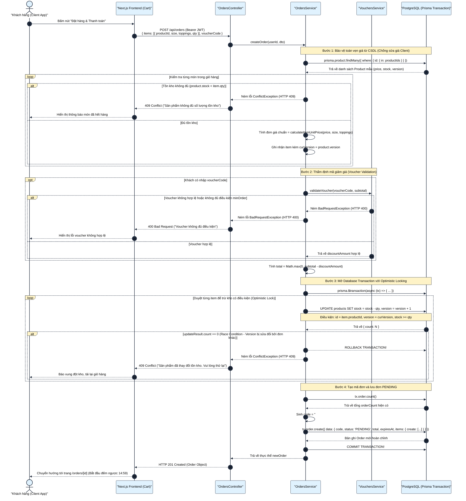

---

### 7.2 Sequence Diagram 2: Luồng Thanh toán Idempotent Replay, Race Defense P2002 & Tích điểm Loyalty

Sơ đồ mô tả quy trình thực thi API `POST /api/payments`, minh họa cơ chế bảo vệ giao dịch không lặp tiền (Idempotency), xử lý lỗi va chạm `Prisma P2002`, quy trình hoàn kho khi giả lập lỗi thanh toán (`forceFail`) và cộng điểm thưởng thành viên:

> **Tài nguyên biểu đồ:** [Mã nguồn Mermaid (.mmd)](./diagrams/sequence-idempotent-payment.mmd) &bull; [Ảnh Vector SVG phóng to 1.000%](./diagrams/svg/sequence-idempotent-payment.svg) &bull; Nhập vào Draw.io: `Ctrl + Shift + I`

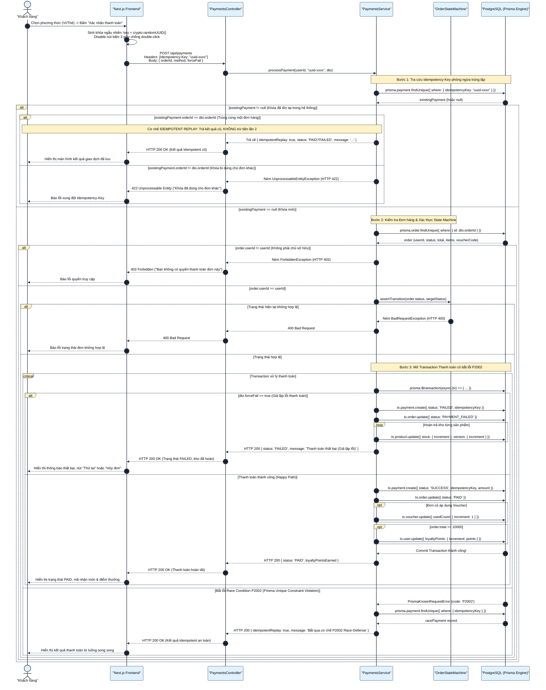

---

## 8. ORDER STATE MACHINE — SƠ ĐỒ MÁY TRẠNG THÁI ĐƠN HÀNG

### 8.1 Biểu đồ chuyển đổi trạng thái đơn hàng (Mermaid)

Sơ đồ máy trạng thái biểu diễn chính xác cấu trúc định nghĩa trong tệp `apps/backend/src/common/state-machine/order-state-machine.ts`, chuẩn hóa theo Mục 9.1 tài liệu đặc tả đồ án BrewLite và các quyết định kỹ thuật trong **ADR-007**:

> **Tài nguyên biểu đồ:** [Mã nguồn Mermaid (.mmd)](./diagrams/order-state-machine.mmd) &bull; [Ảnh Vector SVG phóng to 1.000%](./diagrams/svg/order-state-machine.svg) &bull; Nhập vào Draw.io: `Ctrl + Shift + I`

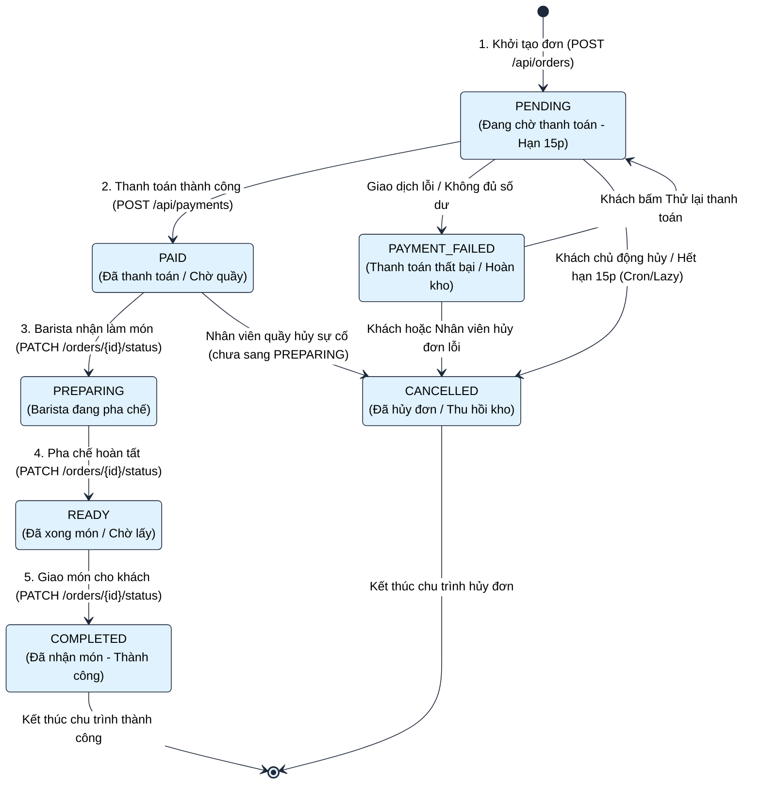

---

### 8.2 Ma trận chuyển đổi trạng thái (State Transition Matrix)

Bảng ma trận thể hiện tính hợp lệ của việc chuyển đổi giữa trạng thái hiện tại (hàng) sang trạng thái kế tiếp (cột). Mọi chuyển đổi đánh dấu ❌ sẽ lập tức bị hàm `assertTransition()` phát hiện và ném ngoại lệ `BadRequestException` (HTTP 400):

| Trạng thái hiện tại \ Đích | `PENDING` | `PAID` | `PREPARING` | `READY` | `COMPLETED` | `PAYMENT_FAILED` | `CANCELLED` |
|---|:---:|:---:|:---:|:---:|:---:|:---:|:---:|
| **`PENDING`** | ❌ | ✅ *(Thanh toán OK)* | ❌ | ❌ | ❌ | ✅ *(Cổng báo lỗi)* | ✅ *(Khách hủy / Cron 15p)* |
| **`PAYMENT_FAILED`** | ✅ *(Thử lại)* | ❌ | ❌ | ❌ | ❌ | ❌ | ✅ *(Hủy đơn lỗi)* |
| **`PAID`** | ❌ | ❌ | ✅ *(Barista làm)* | ❌ | ❌ | ❌ | ✅ *(Staff hủy tại quầy)* |
| **`PREPARING`** | ❌ | ❌ | ❌ | ✅ *(Pha xong)* | ❌ | ❌ | ❌ *(Đang làm cấm hủy)* |
| **`READY`** | ❌ | ❌ | ❌ | ❌ | ✅ *(Đã giao)* | ❌ | ❌ *(Đã xong cấm hủy)* |
| **`COMPLETED` (Kết thúc)** | ❌ | ❌ | ❌ | ❌ | ❌ | ❌ | ❌ *(Bất biến)* |
| **`CANCELLED` (Kết thúc)** | ❌ | ❌ | ❌ | ❌ | ❌ | ❌ | ❌ *(Bất biến)* |

---

### 8.3 Bảng quy tắc phân quyền và hành động biên (Invariants & Side Effects)

| Chuyển trạng thái | Tác nhân có thẩm quyền | Điều kiện tiền quyết bắt buộc | Tác vụ phụ trợ bắt buộc (Side Effects) |
|---|---|---|---|
| `[*] -> PENDING` | `CUSTOMER` | Giỏ hàng có món, số lượng tồn kho `stock >= qty`. | Mở transaction: trừ kho Optimistic Lock (`stock -= qty, version += 1`), tạo `code` dạng `#10xx`, đặt `expiresAt = now() + 15m`. |
| `PENDING -> PAID` | `CUSTOMER` (qua Cổng thanh toán) | Đơn chưa hết hạn (`expiresAt > now()`), `Idempotency-Key` hợp lệ. | Tạo bản ghi `Payment` (SUCCESS), tăng `Voucher.usedCount`, cộng điểm Loyalty (`floor(total / 10000)`). |
| `PENDING -> PAYMENT_FAILED` | `CUSTOMER` (qua Mock Gateway) | Nhận tín hiệu thanh toán thất bại từ đối tác thanh toán. | Tạo bản ghi `Payment` (FAILED), **hoàn trả lại tồn kho vào sản phẩm** (`stock += qty, version += 1`). |
| `PAYMENT_FAILED -> PENDING` | `CUSTOMER` | Khách hàng chủ động bấm "Thử lại thanh toán". | Tạm thời giữ nguyên đơn để tạo giao dịch thanh toán mới. |
| `PENDING -> CANCELLED` | `CUSTOMER` hoặc `CRON_SYSTEM` | Khách tự bấm hủy HOẶC đơn đã quá hạn 15 phút (`expiresAt < now()`). | Mở transaction: cập nhật trạng thái `CANCELLED` và **hoàn trả tồn kho** toàn bộ các sản phẩm trong đơn. |
| `PAYMENT_FAILED -> CANCELLED` | `CUSTOMER` hoặc `STAFF` | Đơn hàng đang ở trạng thái thanh toán lỗi. | Chuyển `CANCELLED` (Tồn kho đã được hoàn ở bước `PAYMENT_FAILED` nên không hoàn đúp). |
| `PAID -> PREPARING` | `STAFF` hoặc `ADMIN` | Đơn đã thanh toán thành công, hiển thị tại hàng đợi KDS. | Cập nhật trạng thái hiển thị trên màn hình KDS quầy bar sang màu cam cảnh báo. |
| `PAID -> CANCELLED` | `STAFF` hoặc `ADMIN` (Đặc quyền) | Sự cố tại quầy (máy hỏng, hết nguyên liệu đột xuất) và **chưa bắt đầu pha chế**. | Khách không được tự hủy. Chỉ Staff/Admin được hủy. Bắt buộc **hoàn trả tồn kho vào sản phẩm** (`stock += qty`). |
| `PREPARING -> READY` | `STAFF` hoặc `ADMIN` | Barista đã hoàn thành việc chế biến đồ uống. | Cập nhật trạng thái hiển thị món đã xong, phát tín hiệu mời khách đến quầy nhận nước. |
| `READY -> COMPLETED` | `STAFF` hoặc `ADMIN` | Khách xuất trình mã đơn `#10xx` và nhận đồ uống tại quầy. | Đóng đơn hàng, kết thúc hoàn toàn chu trình đơn. Khóa vĩnh viễn mọi thao tác chỉnh sửa. |

---

## 9. TỔNG KẾT VÀ HƯỚNG DẪN THỰC THI (VERIFICATION & NEXT STEPS)

Tài liệu này đóng vai trò là bản đặc tả kỹ thuật và kiến trúc chuẩn hóa cấp cao nhất (Baseline Architecture Spec) cho toàn bộ dự án **BrewLite VER 1.0**. Tất cả các lập trình viên (Developers), kỹ sư kiểm thử (QA/QC) và giảng viên nghiệm thu cần tuân thủ các nguyên tắc sau:

1. **Tính tương thích mã nguồn:** Mọi thực thể, thuộc tính và tên trường trong ERD và Data Dictionary phải đồng nhất tuyệt đối với tệp lược đồ Prisma `apps/backend/prisma/schema.prisma`.
2. **Tính tuân thủ máy trạng thái:** Không được phép bypass hàm `assertTransition()` trong bất kỳ endpoint cập nhật đơn hàng nào.
3. **Kiểm thử tự động bắt buộc:** Bộ kiểm thử tích hợp (Integration Tests) cần bao phủ tối thiểu:
   - Chặn đứng mọi chuyển đổi trạng thái đơn hàng vi phạm ma trận (Task 10.1).
   - Kiểm tra Idempotency Replay và Race Defense P2002 khi có 2 request song song (Task 10.2).
   - Kiểm tra đặt hàng đồng thời với Optimistic Locking không vượt quá tồn kho (Task 10.3).
   - Kiểm tra dọn dẹp đơn quá hạn 15 phút và hoàn kho tự động của Cron Cleanup Service (ADR-007).
4. **Liên kết điều hướng:** Tham chiếu hướng dẫn cài đặt và kịch bản nghiệm thu tại [README.md](../README.md).
