# TÀI LIỆU KIẾN TRÚC VÀ ĐẶC TẢ HỆ THỐNG PHẦN MỀM BREWLITE
## (Comprehensive System Architecture & Design Specification)

**Hệ thống:** Nền tảng Đặt đồ uống & Thanh toán không tiền mặt BrewLite (VER 1.0)  
**Môn học:** Công nghệ Phần mềm (Software Engineering) — Học kỳ I, Năm học 2026–2027  
**Khoa / Trường:** Khoa Công nghệ Thông tin — Trường Đại học Sài Gòn (SGU)  
**Chuẩn tham chiếu:** RUP / Agile Scrum Architecture Standard, ADR-007, Prisma Schema v1.0  
**Ngày cập nhật:** 23/09/2026  
**Tài nguyên biểu đồ & Draw.io:** Toàn bộ 13 biểu đồ đã được chuẩn hóa dưới dạng mã nguồn [Mermaid (.mmd)](./diagrams/) cho phép nhập trực tiếp vào Draw.io (`Ctrl + Shift + I`) để xuất ảnh độ phân giải cao hoặc chèn vào báo cáo. Xem hướng dẫn chi tiết tại [DRAWIO_GUIDE.md](./DRAWIO_GUIDE.md).

---

## MỤC LỤC

1. [TỔNG QUAN HỆ THỐNG & KIẾN TRÚC TỔNG THỂ](#1-tổng-quan-hệ-thống--kiến-trúc-tổng-thể)
2. [BFD (BUSINESS FUNCTION DECOMPOSITION) — SƠ ĐỒ PHÂN RÃ CHỨC NĂNG KINH DOANH](#2-bfd-business-function-decomposition--sơ-đồ-phân-rã-chức-năng-kinh-doanh)
   - [2.1 Sơ đồ phân rã chức năng kinh doanh (Mermaid)](#21-sơ-đồ-phân-rã-chức-năng-kinh-doanh-mermaid)
   - [2.2 Bảng danh mục và từ điển phân rã chức năng](#22-bảng-danh-mục-và-từ-điển-phân-rã-chức-năng)
3. [DFD LV0 (CONTEXT DIAGRAM) — SƠ ĐỒ LUỒNG DỮ LIỆU MỨC NGỮ CẢNH](#3-dfd-lv0-context-diagram--sơ-đồ-luồng-dữ-liệu-mức-ngữ-cảnh)
   - [3.1 Sơ đồ ngữ cảnh hệ thống (Mermaid)](#31-sơ-đồ-ngữ-cảnh-hệ-thống-mermaid)
   - [3.2 Bảng từ điển luồng dữ liệu mức ngữ cảnh](#32-bảng-từ-điển-luồng-dữ-liệu-mức-ngữ-cảnh)
4. [DFD LV1 (DETAILED DATA FLOW DIAGRAM) — SƠ ĐỒ LUỒNG DỮ LIỆU MỨC 1](#4-dfd-lv1-detailed-data-flow-diagram--sơ-đồ-luồng-dữ-liệu-mức-1)
   - [4.1 Sơ đồ luồng dữ liệu mức 1 phân rã chi tiết (Mermaid)](#41-sơ-đồ-luồng-dữ-liệu-mức-1-phân-rã-chi-tiết-mermaid)
   - [4.2 Bảng từ điển kho dữ liệu (Data Store Dictionary)](#42-bảng-từ-điển-kho-dữ-liệu-data-store-dictionary)
   - [4.3 Bảng từ điển luồng dữ liệu chi tiết mức 1](#43-bảng-từ-điển-luồng-dữ-liệu-chi-tiết-mức-1)
5. [USE CASE DIAGRAM & ĐẶC TẢ KỊCH BẢN USE CASE CHUẨN ACADEMIC](#5-use-case-diagram--đặc-tả-kịch-bản-use-case-chuẩn-academic)
   - [5.1 Sơ đồ Use Case tổng quan tinh gọn (Overview — 4 Actors, 5 Packages)](#51-sơ-đồ-use-case-tổng-quan-tinh-gọn-overview--4-actors-5-packages)
   - [5.2 Sơ đồ Use Case phân rã chi tiết — Khách hàng (Customer Use Cases)](#52-sơ-đồ-use-case-phân-rã-chi-tiết--khách-hàng-customer-use-cases)
   - [5.3 Sơ đồ Use Case phân rã chi tiết — Nhân viên Barista (Staff / KDS Use Cases)](#53-sơ-đồ-use-case-phân-rã-chi-tiết--nhân-viên-barista-staff--kds-use-cases)
   - [5.4 Sơ đồ Use Case phân rã chi tiết — Quản trị viên & Tự động hóa (Admin & System Cron)](#54-sơ-đồ-use-case-phân-rã-chi-tiết--quản-trị-viên--tự-động-hóa-admin--system-cron)
   - [5.5 Đặc tả Use Case UC-01: Đặt đồ uống & Áp mã Voucher](#55-đặc-tả-use-case-uc-01-đặt-đồ-uống--áp-mã-voucher)
   - [5.6 Đặc tả Use Case UC-02: Thanh toán không tiền mặt Idempotent](#56-đặc-tả-use-case-uc-02-thanh-toán-không-tiền-mặt-idempotent)
   - [5.7 Đặc tả Use Case UC-03: Barista tiếp nhận & Cập nhật chế biến đơn tại KDS](#57-đặc-tả-use-case-uc-03-barista-tiếp-nhận--cập-nhật-chế-biến-đơn-tại-kds)
6. [ERD (ENTITY-RELATIONSHIP DIAGRAM) & DATA DICTIONARY](#6-erd-entity-relationship-diagram--data-dictionary)
   - [6.1 Sơ đồ quan hệ thực thể chuẩn hóa (Mermaid)](#61-sơ-đồ-quan-hệ-thực-thể-chuẩn-hóa-mermaid)
   - [6.2 Bảng từ điển dữ liệu (Data Dictionary khớp 100% Prisma Schema)](#62-bảng-từ-điển-dữ-liệu-data-dictionary-khớp-100-prisma-schema)
   - [6.3 Định nghĩa các kiểu liệt kê (Enumerations)](#63-định-nghĩa-các-kiểu-liệt-kê-enumerations)
7. [SEQUENCE DIAGRAMS — SƠ ĐỒ TUẦN TỰ CHO CÁC LUỒNG NGHIỆP VỤ CỐT LÕI](#7-sequence-diagrams--sơ-đồ-tuần-tự-cho-các-luồng-nghiệp-vụ-cốt-lõi)
   - [7.1 Sequence Diagram 1: Luồng Đăng nhập & Đặt lại mật khẩu](#71-sequence-diagram-1-luồng-đăng-nhập--đặt-lại-mật-khẩu)
   - [7.2 Sequence Diagram 2: Luồng Đặt đồ uống & Kiểm tra tồn kho](#72-sequence-diagram-2-luồng-đặt-đồ-uống--kiểm-tra-tồn-kho)
   - [7.3 Sequence Diagram 3: Luồng Thanh toán không tiền mặt & Tích điểm thưởng](#73-sequence-diagram-3-luồng-thanh-toán-không-tiền-mặt--tích-điểm-thưởng)
   - [7.4 Sequence Diagram 4: Luồng Tiếp nhận & Pha chế tại quầy (KDS)](#74-sequence-diagram-4-luồng-tiếp-nhận--pha-chế-tại-quầy-kds)
8. [ORDER STATE MACHINE — SƠ ĐỒ MÁY TRẠNG THÁI ĐƠN HÀNG](#8-order-state-machine--sơ-đồ-máy-trạng-thái-đơn-hàng)
   - [8.1 Biểu đồ chuyển đổi trạng thái đơn hàng (Mermaid)](#81-biểu-đồ-chuyển-đổi-trạng-thái-đơn-hàng-mermaid)
   - [8.2 Ma trận chuyển đổi trạng thái (State Transition Matrix)](#82-ma-trận-chuyển-đổi-trạng-thái-state-transition-matrix)
   - [8.3 Bảng quy tắc phân quyền và hành động biên (Invariants & Side Effects)](#83-bảng-quy-tắc-phân-quyền-và-hành-động-biên-invariants--side-effects)

---

## 1. TỔNG QUAN HỆ THỐNG & KIẾN TRÚC TỔNG THỂ

BrewLite là hệ thống phần mềm chuyên biệt phục vụ chuỗi dịch vụ cà phê và đồ uống thông minh, áp dụng mô hình vận hành không tiền mặt (Cashless Ordering & Payment). Hệ thống được thiết kế theo kiến trúc phân tầng (Layered Architecture) với sự tách biệt rõ ràng giữa tầng Client-side Web App và Server-side Microservices/Monolith Modular:

- **Frontend (Giao diện người dùng):** Phát triển trên nền tảng **Next.js 14+ (React, TypeScript)**, tối ưu hiển thị thực đơn, giỏ hàng, đồng hồ đếm ngược 15 phút thời hạn thanh toán đơn hàng, cùng màn hình điều phối quầy pha chế.
- **Backend (Bộ xử lý nghiệp vụ trung tâm):** Xây dựng trên nền tảng **NestJS**, tích hợp cơ chế xác thực người dùng, kiểm tra tính hợp lệ của dữ liệu, và mô hình máy trạng thái đơn hàng chuẩn mực.
- **Tầng lưu trữ dữ liệu (Cơ sở dữ liệu):** Sử dụng hệ quản trị cơ sở dữ liệu quan hệ **PostgreSQL 16**, kết nối và đồng bộ lược đồ thông qua **Prisma ORM**.
- **Cơ chế kiểm soát đồng thời (Kiểm soát tồn kho an toàn):** Áp dụng kỹ thuật kiểm soát phiên bản (Optimistic Locking) trên thực thể sản phẩm qua trường `version` nhằm loại trừ hiện tượng bán âm kho khi nhiều người cùng đặt món.
- **Cơ chế phòng thủ thanh toán (Chống trùng lặp giao dịch):** Áp dụng khóa định danh duy nhất (Idempotency Key) kết hợp ràng buộc toàn vẹn cơ sở dữ liệu để ngăn chặn triệt để hành vi trừ tiền lặp lại.

---

## 2. BFD (BUSINESS FUNCTION DECOMPOSITION) — SƠ ĐỒ PHÂN RÃ CHỨC NĂNG KINH DOANH

### 2.1 Sơ đồ phân rã chức năng kinh doanh (Mermaid)

> **Tài nguyên biểu đồ:** [Mã nguồn Mermaid (.mmd)](./diagrams/bfd.mmd) • Nhập vào Draw.io: `Ctrl + Shift + I`

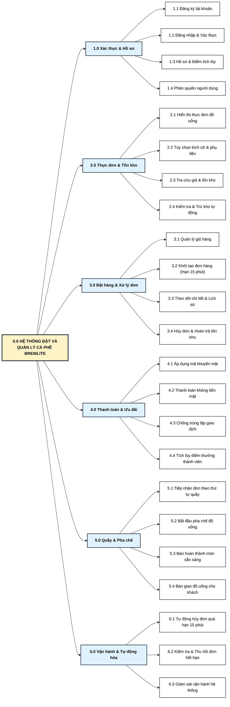

---

### 2.2 Bảng danh mục và từ điển phân rã chức năng

| Mã CN | Tên chức năng con | Mô tả chi tiết nghiệp vụ | Tác nhân thực thi | Ràng buộc nghiệp vụ liên quan |
|---|---|---|---|---|
| **F1.1** | Đăng ký tài khoản | Tiếp nhận email, mật khẩu; mã hóa mật khẩu an toàn, khởi tạo điểm tích lũy ban đầu bằng 0. | Khách hàng mới | Email là duy nhất, đúng định dạng hợp lệ. |
| **F1.2** | Đăng nhập & Xác thực | Xác thực thông tin tài khoản người dùng, cấp quyền truy cập theo vai trò. | Khách hàng / Nhân viên / Quản trị viên | Giới hạn số lần đăng nhập sai liên tiếp để bảo vệ tài khoản. |
| **F1.3** | Quản lý hồ sơ & Điểm | Xem thông tin cá nhân và tổng số điểm thưởng tích lũy từ các hóa đơn đã thanh toán thành công. | Khách hàng | Người dùng chỉ được xem dữ liệu thuộc quyền sở hữu của chính mình. |
| **F1.4** | Phân quyền người dùng | Kiểm soát phân quyền 3 vai trò: Khách hàng, Nhân viên pha chế, Quản trị viên. | Hệ thống bảo mật | Chặn trái phép truy cập vào các màn hình và chức năng không thuộc thẩm quyền. |
| **F2.1** | Hiển thị thực đơn | Liệt kê toàn bộ các món đồ uống đang phục vụ kèm hình ảnh, tên món, giá niêm yết và trạng thái còn hàng. | Khách hàng / Nhân viên | Phản hồi nhanh chóng cho giao diện người dùng. |
| **F2.2** | Tùy chọn món đồ uống | Cho phép chọn kích cỡ (S/M/L) và danh sách phụ liệu (Topping). Tự động tính đơn giá chính xác. | Khách hàng | Phụ thu theo kích cỡ và phụ liệu đã chọn. |
| **F2.3** | Tra cứu tồn kho | Tra cứu số lượng tồn kho khả dụng và phiên bản dữ liệu hiện hành của từng sản phẩm. | Bộ xử lý nghiệp vụ | Kiểm tra tính sẵn sàng trước khi tiếp nhận đặt món. |
| **F2.4** | Trừ kho an toàn | Trừ số lượng tồn kho có kiểm soát phiên bản dữ liệu để chống bán âm kho khi nhiều người đặt cùng lúc. | Bộ xử lý nghiệp vụ / CSDL | Báo lỗi và hủy giao dịch nếu số lượng tồn kho không còn đáp ứng đủ. |
| **F3.1** | Quản lý giỏ hàng | Lưu trữ tạm thời danh sách món đã chọn, số lượng và tính tổng tiền giỏ hàng trên giao diện. | Khách hàng | Cập nhật tức thời khi người dùng thay đổi số lượng hoặc thêm món. |
| **F3.2** | Khởi tạo đơn hàng | Tiếp nhận giỏ hàng, áp dụng mã khuyến mãi, trừ số lượng tồn kho và tạo đơn hàng chờ thanh toán trong 15 phút. | Khách hàng | Gán mã định danh duy nhất (ví dụ: `#1001`), thiết lập thời hạn thanh toán 15 phút. |
| **F3.3** | Theo dõi chi tiết đơn | Xem chi tiết thành tiền, thời hạn thanh toán còn lại, mã nhận món tại quầy và trạng thái đơn hàng. | Khách hàng / Nhân viên | Khách chỉ xem đơn của mình; Nhân viên và Quản trị viên xem toàn bộ. |
| **F3.4** | Hủy đơn & Hoàn kho | Chuyển đơn sang trạng thái Đã hủy và tự động hoàn trả số lượng vào tồn kho. | Khách hàng / Nhân viên / Bộ xử lý tự động | Khách hủy khi chờ thanh toán hoặc lỗi; Nhân viên hủy khi có sự cố tại quầy. |
| **F4.1** | Áp dụng mã khuyến mãi | Kiểm tra điều kiện mã: thời hạn hiệu lực, giá trị đơn tối thiểu và số lượt sử dụng tối đa. | Khách hàng | Tính số tiền giảm giá chính xác (% hoặc số tiền cố định). |
| **F4.2** | Thanh toán không tiền mặt | Hỗ trợ thanh toán qua Ví điện tử hoặc Thẻ ngân hàng liên kết. | Khách hàng | Xác thực giao dịch thanh toán hợp lệ và an toàn. |
| **F4.3** | Chống trùng lặp giao dịch | Kiểm soát chống thanh toán trùng bằng mã giao dịch duy nhất. Nếu trùng đơn, trả về kết quả cũ mà không trừ tiền lần hai. | Bộ xử lý thanh toán / CSDL | Đảm bảo an toàn tuyệt đối, ngăn ngừa hành vi trừ tiền lặp lại. |
| **F4.4** | Tích lũy điểm thưởng | Khi đơn chuyển sang Đã thanh toán, tự động cộng 1 điểm cho mỗi 10.000đ thanh toán vào tài khoản thành viên. | Hệ thống tích điểm | Chỉ cộng điểm đúng 1 lần duy nhất cho mỗi đơn hàng thanh toán thành công. |
| **F5.1** | Hàng đợi quầy pha chế | Hiển thị danh sách các đơn đã thanh toán theo thứ tự thời gian (đơn vào trước làm trước). | Nhân viên pha chế | Tự động cập nhật các đơn hàng có trạng thái Đã thanh toán, Đang làm, Sẵn sàng. |
| **F5.2** | Bắt đầu pha chế | Nhân viên chuyển trạng thái đơn sang Đang pha chế khi bắt đầu làm món tại quầy. | Nhân viên pha chế | Tuân thủ nghiêm ngặt theo quy tắc vòng đời đơn hàng. |
| **F5.3** | Báo hoàn tất món | Chuyển trạng thái đơn sang Sẵn sàng phục vụ khi đồ uống đã pha chế xong. | Nhân viên pha chế | Kích hoạt thông báo sẵn sàng nhận đồ uống trên màn hình khách hàng. |
| **F5.4** | Bàn giao đồ uống | Khách xuất trình mã đơn tại quầy, nhân viên xác nhận và chuyển trạng thái sang Hoàn tất. | Nhân viên pha chế | Kết thúc toàn bộ vòng đời vận hành của đơn hàng. |
| **F6.1** | Tự động hủy đơn quá hạn | Bộ xử lý tự động định kỳ quét các đơn chờ thanh toán đã quá 15 phút để hủy và hoàn trả kho. | Bộ xử lý tự động (Cron) | Chạy ngầm độc lập định kỳ mỗi 5 phút. |
| **F6.2** | Thu hồi đơn hết hạn khi tra cứu | Khi người dùng xem chi tiết đơn đã quá hạn 15 phút, hệ thống tự động cập nhật hủy và hoàn kho tức thời. | Bộ xử lý nghiệp vụ | Tránh hiển thị trạng thái chờ thanh toán cho đơn đã hết hạn. |
| **F6.3** | Giám sát vận hành hệ thống | Kiểm tra tình trạng kết nối cơ sở dữ liệu và khả năng sẵn sàng phục vụ của toàn bộ hệ thống. | Giám sát viên / Hệ thống | Đảm bảo độ tin cậy và tính liên tục trong vận hành. |

---

## 3. DFD LV0 (CONTEXT DIAGRAM) — SƠ ĐỒ LUỒNG DỮ LIỆU MỨC NGỮ CẢNH

### 3.1 Sơ đồ ngữ cảnh hệ thống (Mermaid)

> **Tài nguyên biểu đồ:** [Mã nguồn Mermaid (.mmd)](./diagrams/dfd-lv0.mmd) • Nhập vào Draw.io: `Ctrl + Shift + I`

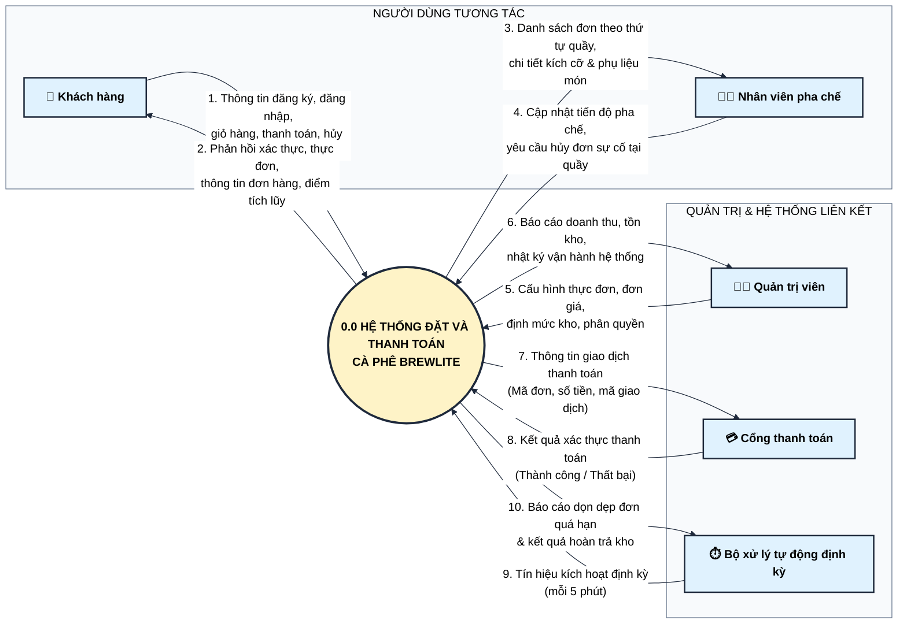

---

### 3.2 Bảng từ điển luồng dữ liệu mức ngữ cảnh

| ID Luồng | Tác nhân liên quan | Chiều | Các trường dữ liệu cốt lõi | Mục đích nghiệp vụ |
|---|---|---|---|---|
| **DF01.1** | Khách hàng | Vào -> Hệ thống | `email`, `password`, `items[{productId, size, toppings, qty}]`, `voucherCode`, `idempotencyKey`, `paymentMethod` | Gửi dữ liệu xác thực, lựa chọn món và lệnh thanh toán giao dịch. |
| **DF01.2** | Khách hàng | Ra <- Hệ thống | `accessToken`, `products[]`, `order{code, status, total, expiresAt}`, `paymentResult`, `loyaltyPoints` | Phản hồi thông tin menu, xác nhận đơn hàng thành công và số dư điểm thưởng. |
| **DF02.1** | Nhân viên Barista | Ra <- Hệ thống | `activeOrders[{code, createdAt, items[{productName, size, toppings, qty}], status}]` | Cung cấp danh sách hàng đợi các đơn đã thanh toán để quầy thực hiện pha chế. |
| **DF02.2** | Nhân viên Barista | Vào -> Hệ thống | `orderId`, `targetStatus ('PREPARING' \| 'READY' \| 'COMPLETED' \| 'CANCELLED')` | Gửi lệnh cập nhật trạng thái chế biến hoặc hủy đơn khi có sự cố tại quầy. |
| **DF03.1** | Quản trị viên | Vào -> Hệ thống | `productData{name, price, stock}`, `userRoleUpdate`, `queryFilters` | Quản lý danh mục thực đơn, số lượng tồn kho định mức và cấu hình quyền hạn. |
| **DF03.2** | Quản trị viên | Ra <- Hệ thống | `auditLogs[]`, `orderMetrics[]`, `inventoryStatus[]` | Hiển thị tình trạng hoạt động và số lượng sản phẩm tồn kho cho cấp quản trị. |
| **DF04.1** | Cổng thanh toán | Ra <- Hệ thống | `orderId`, `amount`, `paymentMethod`, `idempotencyKey` | Chuyển tiếp thông tin giao dịch để xử lý trừ tiền qua tài khoản ví/thẻ của khách. |
| **DF04.2** | Cổng thanh toán | Vào -> Hệ thống | `transactionStatus ('SUCCESS' \| 'FAILED')`, `gatewayRefId` | Trả về mã phản hồi xác nhận trạng thái thanh toán từ đối tác tài chính. |
| **DF05.1** | Cron Daemon | Vào -> Hệ thống | `cronTickEvent ('EVERY_5_MINUTES')`, `currentTime` | Phát tín hiệu thời gian định kỳ để đánh thức dịch vụ dọn dẹp đơn rác. |
| **DF05.2** | Cron Daemon | Ra <- Hệ thống | `cleanedOrdersCount`, `restockedItemsSummary[]` | Ghi nhận nhật ký (Log) số lượng đơn hàng hết hạn 15 phút đã được hủy và hoàn kho. |

---

## 4. DFD LV1 (DETAILED DATA FLOW DIAGRAM) — SƠ ĐỒ LUỒNG DỮ LIỆU MỨC 1

### 4.1 Sơ đồ luồng dữ liệu mức 1 phân rã chi tiết (Mermaid)

> **Tài nguyên biểu đồ:** [Mã nguồn Mermaid (.mmd)](./diagrams/dfd-lv1.mmd) &bull; Nhập vào Draw.io: `Ctrl + Shift + I`

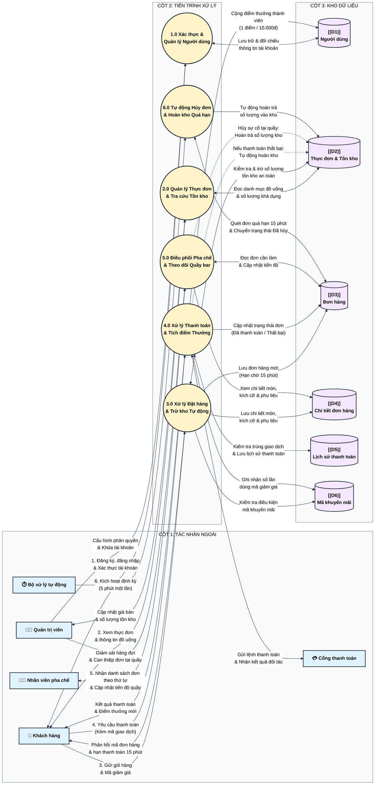

---

### 4.2 Bảng từ điển kho dữ liệu (Data Store Dictionary)

| Mã kho | Tên bảng CSDL vật lý | Mô tả mục đích lưu trữ | Thực thể chính liên kết | Tần suất đọc / ghi |
|---|---|---|---|---|
| **D1** | `users` | Lưu trữ tài khoản người dùng, phân quyền vai trò, mật khẩu đã mã hóa, và tổng điểm thưởng tích lũy. | User | Đọc rất cao (xác thực quyền truy cập); Ghi trung bình (đăng ký mới, cộng điểm thưởng). |
| **D2** | `products` | Lưu trữ danh mục đồ uống, giá niêm yết cơ bản, số lượng tồn kho định mức, và phiên bản kiểm soát tồn kho (`version`). | Product | Đọc cực cao (xem thực đơn); Ghi cao (trừ kho khi đặt, hoàn kho khi hủy). |
| **D3** | `orders` | Quản lý vòng đời đơn hàng, mã đơn định dạng `#10xx`, tổng tiền, giảm giá, hạn thanh toán 15 phút (`expiresAt`), và trạng thái đơn. | Order | Đọc rất cao (khách theo dõi đơn, nhân viên theo dõi quầy); Ghi cao (tạo đơn, đổi trạng thái). |
| **D4** | `order_items` | Lưu snapshot cấu hình đồ uống tại thời điểm đặt (tên món, size S/M/L, danh sách phụ liệu, đơn giá, số lượng, thành tiền). | OrderItem | Đọc cao (hiển thị chi tiết đơn, quầy pha chế làm món); Ghi khi tạo đơn hàng mới. |
| **D5** | `payments` | Lưu trữ lịch sử giao dịch thanh toán không tiền mặt, mã chống trùng lặp giao dịch (`idempotencyKey`), số tiền và kết quả giao dịch. | Payment | Đọc trung bình (kiểm tra chống trùng lặp); Ghi trung bình (mỗi lần bấm thanh toán). |
| **D6** | `vouchers` | Lưu trữ các mã khuyến mãi giảm giá, điều kiện giá trị đơn tối thiểu (`minOrder`), hạn mức sử dụng và số lần đã áp dụng thực tế (`usedCount`). | Voucher | Đọc cao (kiểm tra điều kiện hợp lệ); Ghi thấp (tăng lượt sử dụng khi đơn thanh toán thành công). |

---

### 4.3 Bảng từ điển luồng dữ liệu chi tiết mức 1

| Mã luồng | Xuất phát | Đích đến | Cấu trúc dữ liệu chi tiết | Mô tả quy tắc xử lý |
|---|---|---|---|---|
| **F_P1_D1** | Tiến trình P1.0 | Kho D1 (`users`) | `{ id, email, passwordHash, role, loyaltyPoints, createdAt }` | Ghi nhận người dùng mới hoặc truy vấn thông tin để đối chiếu mật khẩu đã mã hóa. |
| **F_P2_D2** | Kho D2 (`products`) | Tiến trình P2.0 | `{ id, name, price, description, imageUrl, stock, version }` | Truy xuất toàn bộ danh mục sản phẩm đang mở bán để hiển thị cho giao diện người dùng. |
| **F_P3_D6** | Tiến trình P3.0 | Kho D6 (`vouchers`) | `{ code, type, value, minOrder, usageLimit, usedCount, expiresAt }` | Kiểm tra điều kiện áp dụng voucher theo tổng tiền đơn và thời hạn hiệu lực. |
| **F_P3_D2** | Tiến trình P3.0 | Kho D2 (`products`) | `{ productId, stockReduction, expectedVersion }` | Trừ số lượng tồn kho an toàn, kiểm soát xung đột dữ liệu khi nhiều người cùng đặt món. |
| **F_P3_D3** | Tiến trình P3.0 | Kho D3 (`orders`) | `{ id, code, userId, status='PENDING', subtotal, discountAmount, total, expiresAt=now()+15m }` | Tạo bản ghi đơn hàng mới có thời hạn thanh toán giới hạn trong 15 phút. |
| **F_P3_D4** | Tiến trình P3.0 | Kho D4 (`order_items`) | `{ orderId, productId, productName, size, toppings, qty, unitPrice, lineTotal }` | Ghi nhận danh sách món đã chọn (đã tính giá phụ thuộc size và phụ liệu). |
| **F_P4_D5** | Tiến trình P4.0 | Kho D5 (`payments`) | `{ id, orderId, idempotencyKey, amount, method, status }` | Lưu kết quả giao dịch thanh toán; phát hiện và xử lý an toàn nếu trùng lặp mã giao dịch. |
| **F_P4_D3** | Tiến trình P4.0 | Kho D3 (`orders`) | `{ orderId, status='PAID' \| 'PAYMENT_FAILED' }` | Cập nhật trạng thái đơn hàng sau khi nhận phản hồi từ đối tác thanh toán. |
| **F_P4_D1** | Tiến trình P4.0 | Kho D1 (`users`) | `{ userId, pointsEarned }` | Tích điểm thưởng thành viên tự động sau khi thanh toán thành công (1 điểm / 10.000đ). |
| **F_P5_D3** | Tiến trình P5.0 | Kho D3 (`orders`) | `{ listOrders: status IN ('PAID', 'PREPARING', 'READY') }` | Lấy danh sách hàng đợi theo thứ tự thời gian (đơn vào trước làm trước) cho quầy pha chế. |
| **F_P5_UPD** | Tiến trình P5.0 | Kho D3 (`orders`) | `{ orderId, nextStatus }` | Nhân viên pha chế chuyển trạng thái qua từng nấc chế biến hoặc hủy đơn tại quầy khi có sự cố. |
| **F_P6_D3** | Tiến trình P6.0 | Kho D3 (`orders`) | `{ timeoutOrders: status='PENDING' AND expiresAt < now() }` | Quét tìm các đơn hàng bị bỏ rơi quá hạn 15 phút để kích hoạt hủy tự động. |
| **F_P6_D2** | Tiến trình P6.0 | Kho D2 (`products`) | `{ productId, restoreQty }` | Tự động hoàn trả số lượng vào tồn kho sau khi đơn hàng bị hủy bỏ. |
| **F_ADMIN_P1**| Quản trị viên | Tiến trình P1.0 | `{ userId, role: 'CUSTOMER' \| 'STAFF' \| 'ADMIN' }` | Quản trị viên cấu hình phân quyền hoặc khóa/mở tài khoản người dùng. |
| **F_ADMIN_P2**| Quản trị viên | Tiến trình P2.0 | `{ id, name, price, description, imageUrl, stock }` | Quản trị viên cập nhật thông tin sản phẩm và điều chỉnh số lượng tồn kho thực tế. |
| **F_P4_GW** | Tiến trình P4.0 | Cổng thanh toán | `{ orderId, amount, paymentMethod, idempotencyKey }` | Chuyển tiếp yêu cầu thanh toán không tiền mặt sang cổng đối tác liên kết. |
| **F_GW_P4** | Cổng thanh toán | Tiến trình P4.0 | `{ transactionStatus: 'SUCCESS' \| 'FAILED', gatewayRefId }` | Cổng đối tác trả về kết quả xác thực giao dịch để hệ thống hoàn tất thanh toán. |
| **F_ADMIN_P5**| Quản trị viên | Tiến trình P5.0 | `{ orderId, action: 'CANCEL_FORCE', reason }` | Quản trị viên giám sát hàng đợi quầy pha chế và can thiệp xử lý hủy đơn khẩn cấp khi gặp sự cố. |

---

## 5. USE CASE DIAGRAM & ĐẶC TẢ KỊCH BẢN USE CASE CHUẨN ACADEMIC

### 5.1 Sơ đồ Use Case tổng quan tinh gọn (Overview — 4 Actors, 5 Packages)

Sơ đồ tổng quan cấp cao kết nối 4 tác nhân chính tới 5 phân hệ chức năng cốt lõi của BrewLite, loại bỏ hiện tượng rối dây phức tạp và tạo góc nhìn phân rã rõ ràng theo từng miền nghiệp vụ:

> **Tài nguyên biểu đồ:** [Mã nguồn Mermaid (.mmd)](./diagrams/usecase-overview.mmd) &bull; Nhập vào Draw.io: `Ctrl + Shift + I`

```mermaid
%%{init: {
  'theme': 'base',
  'themeVariables': {
    'primaryColor': '#e0f2fe',
    'primaryTextColor': '#000000',
    'primaryBorderColor': '#1e293b',
    'lineColor': '#1e293b',
    'secondaryColor': '#fef3c7',
    'tertiaryColor': '#ffffff',
    'edgeLabelBackground':'#ffffff',
    'clusterBkg':'#f8fafc',
    'clusterBorder':'#64748b',
    'fontFamily': 'Segoe UI, Arial, sans-serif'
  }
}}%%
flowchart LR
    %% Định nghĩa các lớp màu sắc High-Contrast chữ đen
    classDef actorNode fill:#ffffff,stroke:#1e293b,stroke-width:2.5px,color:#000000,font-weight:700;
    classDef pkgNode fill:#fef3c7,stroke:#1e293b,stroke-width:2px,color:#000000,font-weight:600;
    classDef adminPkg fill:#fee2e2,stroke:#1e293b,stroke-width:2px,color:#000000,font-weight:600;

    %% 4 TÁC NHÂN (ACTORS)
    subgraph ACTORS ["CÁC TÁC NHÂN HỆ THỐNG"]
        direction TB
        ACT_CUSTOMER["👤 Khách hàng"]:::actorNode
        ACT_STAFF["🧑‍🍳 Nhân viên pha chế"]:::actorNode
        ACT_ADMIN["👨‍💼 Quản trị viên"]:::actorNode
        ACT_CRON["⏱️ Bộ xử lý tự động"]:::actorNode
    end

    %% Kế thừa vai trò
    ACT_ADMIN --|> ACT_STAFF

    %% 5 PHÂN HỆ USE CASE CHÍNH
    subgraph PACKAGES ["CÁC PHÂN HỆ CHỨC NĂNG CỐT LÕI"]
        direction TB
        PKG_AUTH["🔐 [PKG-01] Phân hệ Xác thực & Hồ sơ<br>• Đăng ký / Đăng nhập tài khoản<br>• Xem thông tin cá nhân & Điểm tích lũy"]:::pkgNode
        PKG_ORDER["☕ [PKG-02] Phân hệ Thực đơn & Đặt đồ uống<br>• Xem thực đơn, chọn kích cỡ & phụ liệu<br>• Quản lý giỏ hàng, đặt đơn chờ thanh toán<br>• Tự động kiểm tra tồn kho, hủy đơn hàng"]:::pkgNode
        PKG_PAYMENT["💳 [PKG-03] Phân hệ Thanh toán & Điểm thưởng<br>• Áp dụng mã khuyến mãi giảm giá<br>• Thanh toán không tiền mặt (Ví / Thẻ)<br>• Chống trùng giao dịch, tích lũy điểm thưởng"]:::pkgNode
        PKG_KDS["📋 [PKG-04] Phân hệ Pha chế & Quầy bar<br>• Tiếp nhận danh sách đơn theo thứ tự quầy<br>• Cập nhật tiến độ: Đang pha chế ➔ Sẵn sàng<br>• Bàn giao đồ uống, xử lý sự cố tại quầy"]:::pkgNode
        PKG_ADMIN["⚙️ [PKG-05] Phân hệ Quản trị & Tự động hóa<br>• Quản lý danh mục món, giá bán & tồn kho<br>• Quản lý người dùng và cấu hình phân quyền<br>• Tự động hủy đơn hàng quá hạn 15 phút<br>• Tự động hoàn trả số lượng vào kho"]:::adminPkg
    end

    %% KẾT NỐI TÁC NHÂN TỚI PHÂN HỆ
    ACT_CUSTOMER ==>|"Tương tác"| PKG_AUTH
    ACT_CUSTOMER ==>|"Tương tác"| PKG_ORDER
    ACT_CUSTOMER ==>|"Tương tác"| PKG_PAYMENT

    ACT_STAFF ==>|"Vận hành"| PKG_KDS

    ACT_ADMIN ==>|"Toàn quyền"| PKG_ADMIN
    ACT_ADMIN -.->|"Can thiệp trực tiếp"| PKG_KDS
    ACT_ADMIN -.->|"Quản trị dữ liệu"| PKG_ORDER

    ACT_CRON ==>|"Tự động kích hoạt"| PKG_ADMIN
```

---

### 5.2 Sơ đồ Use Case phân rã chi tiết — Khách hàng (Customer Use Cases)

Biểu đồ tập trung toàn bộ hành trình tương tác của khách hàng từ khi xem món, tùy biến, áp mã khuyến mãi, khởi tạo đơn (kèm kiểm soát trừ kho an toàn), thanh toán không tiền mặt chống trùng lặp đến khi tích lũy điểm thưởng hoặc hủy đơn:

> **Tài nguyên biểu đồ:** [Mã nguồn Mermaid (.mmd)](./diagrams/usecase-customer.mmd) &bull; Nhập vào Draw.io: `Ctrl + Shift + I`

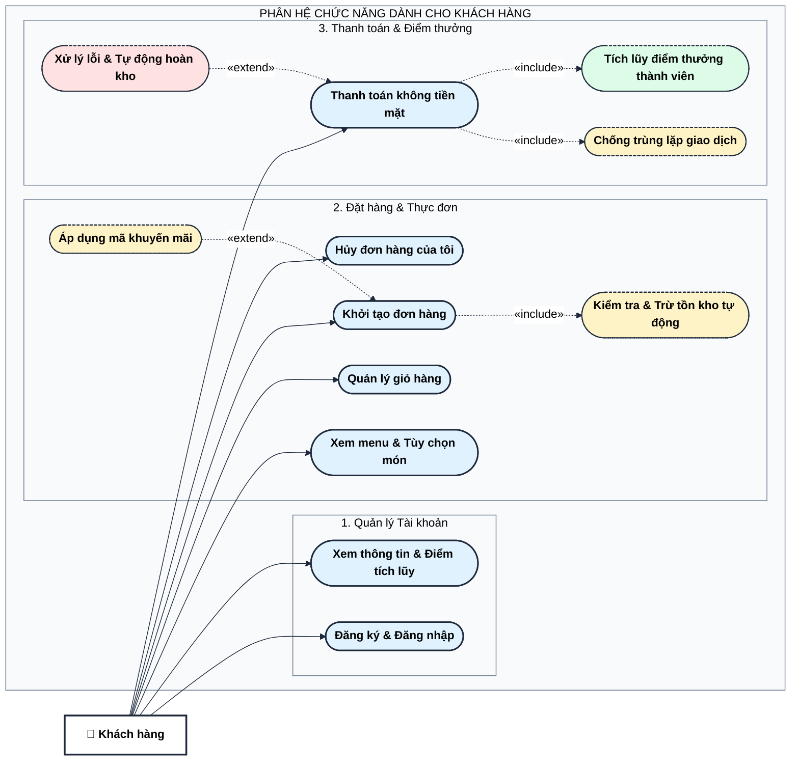

---

### 5.3 Sơ đồ Use Case phân rã chi tiết — Nhân viên Barista (Staff / KDS Use Cases)

Biểu đồ đặc tả quy trình vận hành tại quầy pha chế, bao gồm tiếp nhận danh sách đơn theo thứ tự quầy, điều phối nấc pha chế và xử lý hủy đơn sự cố kèm hoàn trả kho tự động:

> **Tài nguyên biểu đồ:** [Mã nguồn Mermaid (.mmd)](./diagrams/usecase-staff.mmd) &bull; Nhập vào Draw.io: `Ctrl + Shift + I`

```mermaid
%%{init: {
  'theme': 'base',
  'themeVariables': {
    'primaryColor': '#e0f2fe',
    'primaryTextColor': '#000000',
    'primaryBorderColor': '#1e293b',
    'lineColor': '#1e293b',
    'secondaryColor': '#fef3c7',
    'tertiaryColor': '#ffffff',
    'edgeLabelBackground':'#ffffff',
    'clusterBkg':'#f8fafc',
    'clusterBorder':'#64748b',
    'fontFamily': 'Segoe UI, Arial, sans-serif'
  }
}}%%
flowchart LR
    %% Định nghĩa các lớp kiểu dáng chuẩn High-Contrast
    classDef actorNode fill:#ffffff,stroke:#1e293b,stroke-width:2.5px,color:#000000,font-weight:700;
    classDef baseUC fill:#e0f2fe,stroke:#1e293b,stroke-width:2px,color:#000000,font-weight:600;
    classDef actionUC fill:#fef3c7,stroke:#1e293b,stroke-width:2px,color:#000000,font-weight:600;
    classDef subUC fill:#dcfce7,stroke:#1e293b,stroke-width:1.5px,stroke-dasharray: 4 2,color:#000000,font-weight:600;
    classDef cancelUC fill:#fee2e2,stroke:#1e293b,stroke-width:2px,color:#000000,font-weight:600;

    %% TÁC NHÂN
    STAFF["🧑‍🍳 Nhân viên pha chế"]:::actorNode
    ADMIN["👨‍💼 Quản trị viên"]:::actorNode

    ADMIN --|> STAFF

    %% PHÂN HỆ VẬN HÀNH KDS
    subgraph UC_KDS ["PHÂN HỆ QUẦY PHA CHẾ & ĐIỀU PHỐI ĐƠN"]
        direction TB

        UC_QUEUE(["Xem danh sách đơn theo thứ tự quầy"]):::baseUC
        UC_PREP(["Tiếp nhận & Bắt đầu pha chế"]):::actionUC
        UC_READY(["Báo hoàn tất làm món"]):::actionUC
        UC_COMPLETE(["Bàn giao đồ uống cho khách"]):::subUC
        UC_CANCEL_STAFF(["Hủy đơn do sự cố tại quầy"]):::cancelUC
        UC_RESTOCK(["Tự động hoàn trả số lượng vào kho"]):::subUC
    end

    %% TƯƠNG TÁC TÁC NHÂN -> USE CASE
    STAFF --> UC_QUEUE
    STAFF --> UC_PREP
    STAFF --> UC_READY
    STAFF --> UC_COMPLETE
    STAFF --> UC_CANCEL_STAFF

    %% QUAN HỆ INCLUDE
    UC_CANCEL_STAFF -.->|"«include»"| UC_RESTOCK
```

---

### 5.4 Sơ đồ Use Case phân rã chi tiết — Quản trị viên & Tự động hóa (Admin & System Cron)

Biểu đồ đặc tả các tác vụ đặc quyền quản trị danh mục/kho/người dùng cùng 2 cơ chế tự động hóa dọn dẹp đơn quá hạn 15 phút (Cron Daemon 5 phút/lần & Lazy-Check Timeout khi xem đơn):

> **Tài nguyên biểu đồ:** [Mã nguồn Mermaid (.mmd)](./diagrams/usecase-admin-cron.mmd) &bull; Nhập vào Draw.io: `Ctrl + Shift + I`

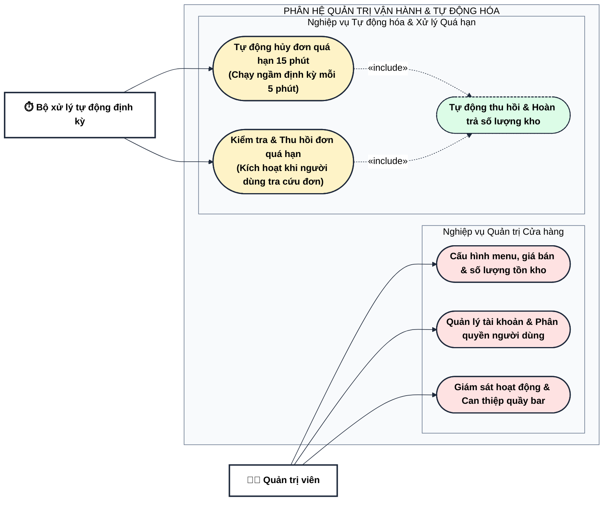

### 5.5 Đặc tả Use Case UC-01: Đặt đồ uống & Áp mã Voucher

| Mục đặc tả | Nội dung chi tiết |
|---|---|
| **Mã Use Case** | **UC-01** |
| **Tên Use Case** | **Đặt đồ uống và áp dụng mã khuyến mãi (Place Order with Voucher)** |
| **Tác nhân chính (Primary Actor)** | Khách hàng đã đăng nhập (`Customer`) |
| **Tác nhân phụ (Supporting Actors)** | Bộ xử lý nghiệp vụ, Cơ sở dữ liệu |
| **Mô tả tóm tắt (Brief Description)** | Khách hàng chuyển các món trong giỏ hàng thành đơn hàng chính thức ở trạng thái Chờ thanh toán (`PENDING`). Hệ thống tính toán tổng tiền, kiểm tra điều kiện mã khuyến mãi, thực hiện trừ số lượng tồn kho an toàn và thiết lập thời hạn thanh toán 15 phút. |
| **Điều kiện tiên quyết (Pre-conditions)** | 1. Khách hàng đã đăng nhập tài khoản hợp lệ.<br>2. Giỏ hàng có ít nhất một sản phẩm hợp lệ.<br>3. Số lượng sản phẩm yêu cầu không vượt quá số lượng tồn kho hiện hành. |
| **Điều kiện sau thành công (Post-conditions)** | 1. Bản ghi đơn hàng mới được tạo với trạng thái Chờ thanh toán (`PENDING`), mã định danh duy nhất (ví dụ: `#1042`), thời hạn thanh toán 15 phút.<br>2. Các dòng chi tiết món (tên món, kích cỡ, phụ liệu, đơn giá) được lưu trữ đầy đủ.<br>3. Số lượng tồn kho của các sản phẩm tương ứng được trừ an toàn.<br>4. Giao diện người dùng chuyển sang màn hình đơn hàng và thanh toán. |
| **Luồng sự kiện chính (Main Flow / Happy Path)** | 1. Khách hàng truy cập màn hình Giỏ hàng, nhập mã khuyến mãi (nếu có) và nhấn nút **"Tiến hành đặt hàng"**.<br>2. Giao diện giỏ hàng gửi thông tin đơn hàng (danh sách món, số lượng, mã khuyến mãi) tới Bộ xử lý đơn hàng.<br>3. Bộ xử lý truy vấn Cơ sở dữ liệu để lấy giá niêm yết và số lượng tồn kho khả dụng của các sản phẩm.<br>4. Bộ xử lý tính toán đơn giá từng món theo kích cỡ và phụ liệu đã chọn, sau đó tính tổng tiền hàng.<br>5. Nếu có mã khuyến mãi: Bộ xử lý tra cứu điều kiện mã, hạn mức sử dụng và thời hạn hiệu lực để tính số tiền giảm giá.<br>6. Bộ xử lý tính tổng tiền thanh toán cuối cùng sau khi khấu trừ tiền giảm giá.<br>7. Bộ xử lý mở giao dịch lưu trữ an toàn trong Cơ sở dữ liệu:<br>&emsp;a. Cập nhật trừ số lượng tồn kho của từng sản phẩm có kiểm soát xung đột phiên bản.<br>&emsp;b. Tự động sinh mã đơn hàng thân thiện (ví dụ: `#1042`).<br>&emsp;c. Thiết lập thời hạn thanh toán là 15 phút kể từ thời điểm tạo đơn.<br>&emsp;d. Tạo bản ghi đơn hàng mới và lưu trữ chi tiết các món vào cơ sở dữ liệu.<br>8. Giao dịch cơ sở dữ liệu được xác nhận thành công.<br>9. Bộ xử lý phản hồi thông tin đơn hàng vừa khởi tạo về giao diện.<br>10. Giao diện giỏ hàng hoàn tất, chuyển hướng khách hàng sang màn hình chi tiết đơn hàng kèm đồng hồ đếm ngược 15 phút. |
| **Luồng ngoại lệ / Rẽ nhánh (Alternative / Exception Flows)** | **A1. Mã khuyến mãi không hợp lệ hoặc hết hạn:**<br>- Tại bước 5, nếu mã không tồn tại, hết hạn, hoặc giá trị đơn hàng chưa đạt mức tối thiểu: Bộ xử lý phản hồi thông báo mã không đủ điều kiện. Giao diện hiển thị thông báo lỗi và yêu cầu khách hàng đổi mã hoặc tiếp tục không áp dụng mã.<br>**A2. Sản phẩm hết hàng hoặc không đủ tồn kho:**<br>- Tại bước 3, nếu số lượng tồn kho nhỏ hơn số lượng đặt: Bộ xử lý thông báo sản phẩm không đủ tồn kho. Giao dịch bị hủy và giao diện hiển thị cảnh báo cho khách hàng.<br>**A3. Xung đột tồn kho do đặt hàng đồng thời:**<br>- Tại bước 7.a, nếu phiên bản dữ liệu tồn kho bị thay đổi bởi giao dịch khác trong cùng thời điểm: Giao dịch tự động hoàn tác để bảo toàn dữ liệu. Bộ xử lý thông báo tồn kho đã thay đổi và hướng dẫn khách hàng thử lại. |
| **Yêu cầu phi chức năng (NFR)** | - Thời gian xử lý đặt hàng và trừ kho < 200ms.<br>- Đảm bảo tính toàn vẹn dữ liệu, tuyệt đối không xảy ra hiện tượng bán âm kho. |

---

### 5.6 Đặc tả Use Case UC-02: Thanh toán không tiền mặt Idempotent

| Mục đặc tả | Nội dung chi tiết |
|---|---|
| **Mã Use Case** | **UC-02** |
| **Tên Use Case** | **Xử lý thanh toán không tiền mặt và chống trùng lặp giao dịch (Cashless Payment with Idempotency)** |
| **Tác nhân chính (Primary Actor)** | Khách hàng sở hữu đơn hàng (`Customer`) |
| **Tác nhân phụ (Supporting Actors)** | Cổng thanh toán liên kết, Bộ xử lý thanh toán, Cơ sở dữ liệu |
| **Mô tả tóm tắt (Brief Description)** | Khách hàng thực hiện thanh toán cho đơn hàng ở trạng thái Chờ thanh toán (`PENDING`) hoặc Thanh toán thất bại (`PAYMENT_FAILED`) bằng Ví điện tử hoặc Thẻ ngân hàng. Hệ thống sử dụng mã định danh giao dịch duy nhất để chống trừ tiền trùng lặp, tích lũy điểm thưởng thành viên và chuyển đơn sang trạng thái Đã thanh toán (`PAID`). |
| **Điều kiện tiên quyết (Pre-conditions)** | 1. Đơn hàng tồn tại và thuộc quyền sở hữu của người dùng đang đăng nhập.<br>2. Trạng thái đơn hàng hiện tại là Chờ thanh toán (`PENDING`) hoặc Thanh toán thất bại (`PAYMENT_FAILED`).<br>3. Yêu cầu thanh toán gửi kèm mã giao dịch duy nhất. |
| **Điều kiện sau thành công (Post-conditions)** | 1. Bản ghi giao dịch thanh toán mới được lưu trữ với trạng thái Thành công (`SUCCESS`).<br>2. Trạng thái đơn hàng chuyển sang Đã thanh toán (`PAID`).<br>3. Ghi nhận số lượt áp dụng mã khuyến mãi (nếu có).<br>4. Tài khoản khách hàng được cộng điểm thưởng tích lũy (+1 điểm / mỗi 10.000đ giá trị thanh toán).<br>5. Màn hình thanh toán hiển thị thông báo thành công và mã nhận đồ uống tại quầy. |
| **Luồng sự kiện chính (Main Flow / Happy Path)** | 1. Khách hàng lựa chọn phương thức thanh toán (Ví điện tử hoặc Thẻ ngân hàng) và bấm **"Xác nhận thanh toán"**.<br>2. Giao diện tạo mã giao dịch duy nhất, tạm khóa nút bấm để chống thao tác đúp, và gửi yêu cầu thanh toán kèm mã giao dịch tới Bộ xử lý thanh toán.<br>3. Bộ xử lý tra cứu mã giao dịch trong lịch sử thanh toán của Cơ sở dữ liệu để kiểm tra trùng lặp.<br>4. Không tìm thấy giao dịch trùng lặp: Bộ xử lý xác minh quyền sở hữu đơn hàng và tính hợp lệ của việc chuyển sang trạng thái Đã thanh toán.<br>5. Bộ xử lý chuyển tiếp yêu cầu xác thực sang cổng thanh toán liên kết.<br>6. Cổng thanh toán đối tác xác thực thông tin và phản hồi kết quả giao dịch thành công.<br>7. Bộ xử lý mở giao dịch lưu trữ an toàn trong Cơ sở dữ liệu:<br>&emsp;a. Tạo bản ghi giao dịch thanh toán với trạng thái Thành công kèm phương thức và mã giao dịch.<br>&emsp;b. Cập nhật trạng thái đơn hàng sang Đã thanh toán (`PAID`).<br>&emsp;c. Nếu đơn có áp dụng mã khuyến mãi: Ghi nhận tăng số lần sử dụng của mã.<br>&emsp;d. Tính điểm thưởng tích lũy (1 điểm / mỗi 10.000đ) và cộng vào tài khoản khách hàng.<br>8. Giao dịch cơ sở dữ liệu được xác nhận thành công.<br>9. Bộ xử lý phản hồi thông báo thanh toán thành công kèm số điểm thưởng vừa tích lũy.<br>10. Giao diện chuyển sang màn hình nhận đồ uống tại quầy. |
| **Luồng ngoại lệ / Rẽ nhánh (Alternative / Exception Flows)** | **A1. Phát hiện trùng lặp mã giao dịch (Chống trừ tiền lần hai):**<br>- Tại bước 3, nếu tìm thấy giao dịch trùng mã ứng với đơn hàng hiện tại: Bộ xử lý không trừ tiền lại hay cập nhật lại cơ sở dữ liệu, mà trả về ngay kết quả giao dịch đã được xác nhận trước đó. Giao diện hiển thị thông báo giao dịch đã hoàn tất.<br>**A2. Mã giao dịch bị dùng lại cho đơn hàng khác:**<br>- Tại bước 3, nếu tìm thấy mã giao dịch trùng lặp nhưng thuộc về một đơn hàng khác: Bộ xử lý từ chối yêu cầu và thông báo mã giao dịch không hợp lệ.<br>**A3. Phòng thủ xung đột gửi đồng thời:**<br>- Nếu hai yêu cầu thanh toán cùng được gửi lên trong cùng một tích tắc: Ràng buộc tính duy nhất của Cơ sở dữ liệu sẽ bảo vệ toàn vẹn, chỉ cho phép một yêu cầu được ghi nhận và yêu cầu còn lại được trả về kết quả thành công mà không gây trừ tiền lặp lại.<br>**A4. Giao dịch thanh toán không thành công (Số dư không đủ hoặc thẻ bị từ chối):**<br>- Tại bước 6, nếu đối tác thanh toán báo lỗi: Bộ xử lý ghi nhận giao dịch thất bại, chuyển trạng thái đơn hàng sang Thanh toán thất bại (`PAYMENT_FAILED`) và tự động hoàn trả số lượng vào kho. Giao diện hiển thị thông báo lỗi kèm tùy chọn thử lại hoặc hủy đơn. |
| **Yêu cầu phi chức năng (NFR)** | - Tuyệt đối không xảy ra tình trạng khách bị trừ tiền hai lần cho cùng một giao dịch.<br>- Thao tác hoàn kho khi lỗi thanh toán phải diễn ra an toàn và nguyên tử (Atomic). |

---

### 5.7 Đặc tả Use Case UC-03: Barista tiếp nhận & Cập nhật chế biến đơn tại KDS

| Mục đặc tả | Nội dung chi tiết |
|---|---|
| **Mã Use Case** | **UC-03** |
| **Tên Use Case** | **Tiếp nhận và điều phối chế biến đơn hàng tại quầy (Order Fulfillment at Bar Counter)** |
| **Tác nhân chính (Primary Actor)** | Nhân viên pha chế (`Staff / Barista`) |
| **Tác nhân phụ (Supporting Actors)** | Quản trị viên (`Admin`), Bộ xử lý nghiệp vụ, Cơ sở dữ liệu |
| **Mô tả tóm tắt (Brief Description)** | Nhân viên pha chế sử dụng màn hình hiển thị quầy bar để theo dõi các đơn hàng đã thanh toán thành công theo thứ tự thời gian (đơn vào trước làm trước), tiếp nhận làm món, thông báo món đã sẵn sàng và hoàn tất bàn giao cho khách hàng. |
| **Điều kiện tiên quyết (Pre-conditions)** | 1. Nhân viên đã đăng nhập tài khoản có vai trò Nhân viên pha chế hoặc Quản trị viên.<br>2. Đơn hàng hiển thị trên quầy ở một trong ba trạng thái: Đã thanh toán (`PAID`), Đang pha chế (`PREPARING`), hoặc Sẵn sàng nhận (`READY`). |
| **Điều kiện sau thành công (Post-conditions)** | 1. Trạng thái đơn hàng được cập nhật tuần tự: `PAID -> PREPARING -> READY -> COMPLETED`.<br>2. Khi chuyển sang Hoàn tất (`COMPLETED`), đơn hàng kết thúc vòng đời và biến mất khỏi danh sách chờ của quầy bar. |
| **Luồng sự kiện chính (Main Flow / Happy Path)** | 1. Nhân viên truy cập giao diện quầy pha chế (được bảo vệ bởi phân quyền vai trò).<br>2. Giao diện tự động tải danh sách các đơn hàng cần xử lý sắp xếp theo thứ tự thời gian tạo đơn (đơn vào trước làm trước).<br>3. Nhân viên nhìn thấy thẻ đơn hàng mới ở trạng thái Đã thanh toán kèm chi tiết kích cỡ (Size S/M/L) và danh sách phụ liệu.<br>4. Nhân viên chuẩn bị nguyên liệu và bấm nút **"Bắt đầu pha chế"**.<br>5. Giao diện gửi yêu cầu chuyển trạng thái sang Đang pha chế (`PREPARING`) tới Bộ xử lý nghiệp vụ.<br>6. Bộ xử lý xác thực quy tắc chuyển trạng thái hợp lệ và cập nhật vào Cơ sở dữ liệu.<br>7. Bộ xử lý phản hồi xác nhận thành công, giao diện đổi màu thẻ đơn sang trạng thái Đang pha chế.<br>8. Sau khi pha chế xong, nhân viên đóng nắp ly, dán tem nhãn và bấm nút **"Đã pha xong (Sẵn sàng)"**.<br>9. Giao diện gửi yêu cầu chuyển trạng thái sang Sẵn sàng nhận (`READY`). Bộ xử lý kiểm tra và cập nhật vào Cơ sở dữ liệu.<br>10. Khách hàng tới quầy xuất trình mã đơn, nhân viên đối chiếu món đồ uống và bấm **"Hoàn tất giao hàng"**.<br>11. Giao diện gửi yêu cầu chuyển trạng thái sang Hoàn tất (`COMPLETED`). Bộ xử lý cập nhật trạng thái kết thúc, thẻ đơn được đóng lại và rời khỏi danh sách làm việc. |
| **Luồng ngoại lệ / Rẽ nhánh (Alternative / Exception Flows)** | **A1. Hủy đơn tại quầy do sự cố nguyên liệu hoặc thiết bị:**<br>- Nếu đơn hàng ở trạng thái Đã thanh toán nhưng quầy gặp sự cố (máy hỏng, hết nguyên liệu đột xuất): Nhân viên bấm nút "Hủy đơn sự cố". Bộ xử lý kiểm tra quyền hạn, chuyển trạng thái đơn sang Đã hủy (`CANCELLED`) đồng thời tự động hoàn trả số lượng vào kho cho toàn bộ sản phẩm.<br>**A2. Vi phạm thứ tự chuyển trạng thái:**<br>- Nếu thao tác nhảy cóc sai quy trình (ví dụ: chuyển từ Đã thanh toán sang Hoàn tất mà chưa qua pha chế): Bộ xử lý phát hiện vi phạm quy tắc máy trạng thái, từ chối cập nhật và hiển thị cảnh báo không hợp lệ. |
| **Yêu cầu phi chức năng (NFR)** | - Màn hình quầy pha chế cập nhật trực quan, phân biệt rõ ràng màu sắc trạng thái (Vàng: Đã thanh toán, Cam: Đang pha chế, Xanh lá: Sẵn sàng). |

---

## 6. ERD (ENTITY-RELATIONSHIP DIAGRAM) & DATA DICTIONARY

### 6.1 Sơ đồ quan hệ thực thể chuẩn hóa (Mermaid)

Sơ đồ quan hệ thực thể dưới đây được thiết kế và ánh xạ **chính xác 100%** theo định nghĩa lược đồ dữ liệu `apps/backend/prisma/schema.prisma` của dự án BrewLite:

> **Tài nguyên biểu đồ:** [Mã nguồn Mermaid (.mmd)](./diagrams/erd.mmd) &bull; Nhập vào Draw.io: `Ctrl + Shift + I`

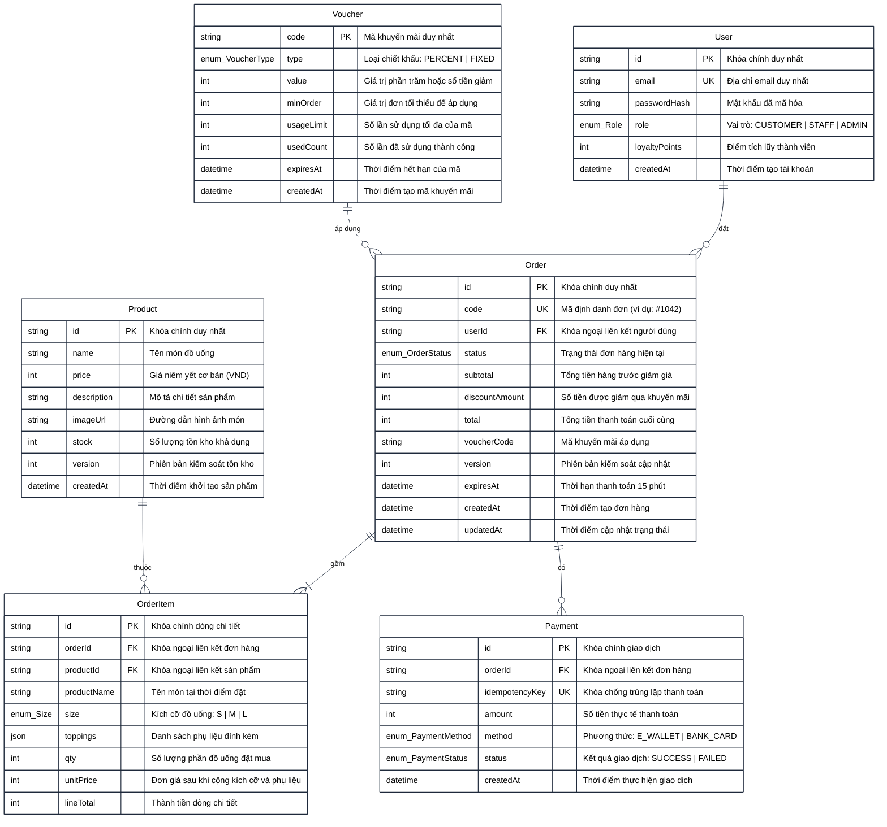

---

### 6.2 Bảng từ điển dữ liệu (Data Dictionary khớp 100% Prisma Schema)

#### Bảng 1: `users` (Thông tin người dùng & Phân quyền)
| Tên cột | Kiểu dữ liệu (Prisma / SQL) | Khóa | Ràng buộc | Giá trị mặc định | Diễn giải nghiệp vụ |
|---|---|---|---|---|---|
| `id` | `String` (UUID) | **PK** | NOT NULL | `uuid()` | Khóa chính định danh tài khoản duy nhất. |
| `email` | `String` (VARCHAR) | **UK** | NOT NULL, UNIQUE | None | Địa chỉ thư điện tử dùng để đăng nhập. |
| `passwordHash` | `String` (VARCHAR) | None | NOT NULL | None | Chuỗi mật khẩu đã băm an toàn qua bcryptjs (salt 10). |
| `role` | `Enum (Role)` | None | NOT NULL | `CUSTOMER` | Vai trò trong hệ thống: `CUSTOMER`, `STAFF`, `ADMIN`. |
| `loyaltyPoints` | `Int` (INTEGER) | None | NOT NULL | `0` | Tổng số điểm thưởng tích lũy (1 điểm / 10.000đ đơn hàng). |
| `createdAt` | `DateTime` (TIMESTAMPTZ) | None | NOT NULL | `now()` | Dấu mốc thời gian đăng ký tài khoản. |

#### Bảng 2: `products` (Danh mục sản phẩm & Tồn kho)
| Tên cột | Kiểu dữ liệu (Prisma / SQL) | Khóa | Ràng buộc | Giá trị mặc định | Diễn giải nghiệp vụ |
|---|---|---|---|---|---|
| `id` | `String` (UUID) | **PK** | NOT NULL | `uuid()` | Khóa chính định danh sản phẩm đồ uống. |
| `name` | `String` (VARCHAR) | None | NOT NULL | None | Tên thương mại của đồ uống (Cà phê sữa, Latte...). |
| `price` | `Int` (INTEGER) | None | NOT NULL | None | Giá niêm yết cơ bản cho kích cỡ nhỏ nhất Size S (VND). |
| `description` | `String` (TEXT) | None | NOT NULL | None | Mô tả thành phần, hương vị của đồ uống. |
| `imageUrl` | `String` (VARCHAR) | None | NOT NULL | None | Đường dẫn hình ảnh minh họa món nước. |
| `stock` | `Int` (INTEGER) | None | NOT NULL | `100` | Số lượng ly/phần hiện có trong kho nguyên liệu. |
| `version` | `Int` (INTEGER) | None | NOT NULL | `0` | Số phiên bản phục vụ Optimistic Locking chống bán vượt kho. |
| `createdAt` | `DateTime` (TIMESTAMPTZ) | None | NOT NULL | `now()` | Thời điểm khởi tạo món đồ uống trên hệ thống. |

#### Bảng 3: `orders` (Quản lý Đơn hàng)
| Tên cột | Kiểu dữ liệu (Prisma / SQL) | Khóa | Ràng buộc | Giá trị mặc định | Diễn giải nghiệp vụ |
|---|---|---|---|---|---|
| `id` | `String` (UUID) | **PK** | NOT NULL | `uuid()` | Khóa chính định danh đơn hàng nội bộ. |
| `code` | `String` (VARCHAR) | **UK** | NOT NULL, UNIQUE | None | Mã đơn hàng thân thiện hiển thị cho khách và quầy (ví dụ: `#1042`). |
| `userId` | `String` (UUID) | **FK** | NOT NULL | None | Khóa ngoại tham chiếu đến `users(id)` (OnDelete: Cascade). |
| `status` | `Enum (OrderStatus)` | None | NOT NULL | `PENDING` | Trạng thái hiện tại trong vòng đời đơn hàng. |
| `subtotal` | `Int` (INTEGER) | None | NOT NULL | None | Tổng giá trị các món trước khi áp dụng chiết khấu (VND). |
| `discountAmount`| `Int` (INTEGER) | None | NOT NULL | `0` | Số tiền được giảm giá trực tiếp từ Voucher (VND). |
| `total` | `Int` (INTEGER) | None | NOT NULL | None | Tổng số tiền thực tế khách hàng phải trả (`subtotal - discountAmount`). |
| `voucherCode` | `String` (VARCHAR) | None | NULLABLE | NULL | Mã voucher áp dụng cho đơn (nếu có). |
| `version` | `Int` (INTEGER) | None | NOT NULL | `0` | Phiên bản phục vụ kiểm soát xung đột dữ liệu đơn. |
| `expiresAt` | `DateTime` (TIMESTAMPTZ) | None | NULLABLE | NULL | Hạn thanh toán 15 phút cho đơn `PENDING` theo quy định ADR-007. |
| `createdAt` | `DateTime` (TIMESTAMPTZ) | None | NOT NULL | `now()` | Dấu mốc thời gian tạo đơn hàng. |
| `updatedAt` | `DateTime` (TIMESTAMPTZ) | None | NOT NULL | `@updatedAt` | Thời điểm cập nhật trạng thái gần nhất. |

#### Bảng 4: `order_items` (Chi tiết từng món trong Đơn)
| Tên cột | Kiểu dữ liệu (Prisma / SQL) | Khóa | Ràng buộc | Giá trị mặc định | Diễn giải nghiệp vụ |
|---|---|---|---|---|---|
| `id` | `String` (UUID) | **PK** | NOT NULL | `uuid()` | Khóa chính dòng chi tiết đơn hàng. |
| `orderId` | `String` (UUID) | **FK** | NOT NULL | None | Khóa ngoại liên kết `orders(id)` (OnDelete: Cascade). |
| `productId` | `String` (UUID) | **FK** | NOT NULL | None | Khóa ngoại liên kết `products(id)` (OnDelete: Restrict). |
| `productName` | `String` (VARCHAR) | None | NOT NULL | None | Snapshot tên món tại thời điểm mua (bảo vệ lịch sử khi đổi tên món). |
| `size` | `Enum (Size)` | None | NOT NULL | `S` | Kích cỡ đồ uống đã chọn: `S`, `M`, `L`. |
| `toppings` | `Json` (JSONB) | None | NULLABLE | NULL | Danh sách tên các topping đính kèm (mảng JSON các string). |
| `qty` | `Int` (INTEGER) | None | NOT NULL | `1` | Số lượng phần đồ uống đặt mua. |
| `unitPrice` | `Int` (INTEGER) | None | NOT NULL | None | Đơn giá của 1 ly sau khi cộng phụ thu Size và Topping (VND). |
| `lineTotal` | `Int` (INTEGER) | None | NOT NULL | None | Thành tiền của dòng chi tiết (`unitPrice * qty`). |

#### Bảng 5: `payments` (Lịch sử Giao dịch Thanh toán)
| Tên cột | Kiểu dữ liệu (Prisma / SQL) | Khóa | Ràng buộc | Giá trị mặc định | Diễn giải nghiệp vụ |
|---|---|---|---|---|---|
| `id` | `String` (UUID) | **PK** | NOT NULL | `uuid()` | Khóa chính của bản ghi giao dịch thanh toán. |
| `orderId` | `String` (UUID) | **FK** | NOT NULL | None | Khóa ngoại tham chiếu `orders(id)` (OnDelete: Cascade). |
| `idempotencyKey`| `String` (VARCHAR) | **UK** | NOT NULL, UNIQUE | None | Khóa duy nhất (UUID) chống trùng lặp yêu cầu thanh toán. |
| `amount` | `Int` (INTEGER) | None | NOT NULL | None | Số tiền đã thanh toán trong giao dịch (VND). |
| `method` | `Enum (PaymentMethod)`| None| NOT NULL | None | Phương thức thanh toán: `E_WALLET`, `BANK_CARD`. |
| `status` | `Enum (PaymentStatus)`| None| NOT NULL | None | Kết quả giao dịch: `SUCCESS` hoặc `FAILED`. |
| `createdAt` | `DateTime` (TIMESTAMPTZ) | None | NOT NULL | `now()` | Thời điểm ghi nhận giao dịch thanh toán. |

#### Bảng 6: `vouchers` (Chương trình Khuyến mãi & Giảm giá)
| Tên cột | Kiểu dữ liệu (Prisma / SQL) | Khóa | Ràng buộc | Giá trị mặc định | Diễn giải nghiệp vụ |
|---|---|---|---|---|---|
| `code` | `String` (VARCHAR) | **PK, UK**| NOT NULL, UNIQUE | None | Mã voucher viết hoa (ví dụ: `CHAOBANMOI`, `BREW10`). |
| `type` | `Enum (VoucherType)` | None | NOT NULL | None | Cơ chế giảm giá: `PERCENT` (% giá trị) hoặc `FIXED` (tiền mặt). |
| `value` | `Int` (INTEGER) | None | NOT NULL | None | Giá trị giảm (% nếu là PERCENT, số tiền VND nếu là FIXED). |
| `minOrder` | `Int` (INTEGER) | None | NOT NULL | `0` | Giá trị đơn hàng tối thiểu (`subtotal`) để được áp dụng mã. |
| `usageLimit` | `Int` (INTEGER) | None | NULLABLE | NULL | Tổng số lượt cho phép sử dụng mã trên toàn hệ thống. |
| `usedCount` | `Int` (INTEGER) | None | NOT NULL | `0` | Số lượt mã đã được áp dụng thành công vào các đơn `PAID`. |
| `expiresAt` | `DateTime` (TIMESTAMPTZ) | None | NULLABLE | NULL | Ngày giờ hết hạn sử dụng của mã khuyến mãi. |
| `createdAt` | `DateTime` (TIMESTAMPTZ) | None | NOT NULL | `now()` | Thời điểm mã voucher được ban hành. |

---

### 6.3 Định nghĩa các kiểu liệt kê (Enumerations)

- **`Role`:**
  - `CUSTOMER`: Khách hàng thông thường, có quyền đặt hàng, thanh toán, xem đơn cá nhân và tích điểm.
  - `STAFF`: Nhân viên quầy pha chế, có quyền truy cập KDS, cập nhật trạng thái làm món và hủy đơn PAID khi có sự cố.
  - `ADMIN`: Quản trị viên cao nhất, có toàn quyền trên toàn bộ hệ thống và quản trị dữ liệu.
- **`OrderStatus`:**
  - `PENDING`: Đơn mới tạo, giữ kho tạm thời trong 15 phút chờ thanh toán.
  - `PAID`: Đã thanh toán thành công, chờ Barista tiếp nhận.
  - `PREPARING`: Đang trong quá trình pha chế tại quầy.
  - `READY`: Món nước đã hoàn thành, sẵn sàng phục vụ tại quầy.
  - `COMPLETED`: Đã bàn giao cho khách (Trạng thái kết thúc).
  - `PAYMENT_FAILED`: Thanh toán không thành công, tạm giữ đơn chờ thử lại hoặc hủy.
  - `CANCELLED`: Đã hủy đơn và hoàn trả số lượng vào tồn kho (Trạng thái kết thúc).
- **`Size`:** `S` (Nhỏ - Tiêu chuẩn), `M` (Vừa - Phụ thu +5.000đ), `L` (Lớn - Phụ thu +10.000đ).
- **`PaymentMethod`:** `E_WALLET` (Ví điện tử MoMo/ZaloPay), `BANK_CARD` (Thẻ ngân hàng Napas/Visa/Mastercard).
- **`PaymentStatus`:** `SUCCESS` (Thành công), `FAILED` (Thất bại).
- **`VoucherType`:** `PERCENT` (Giảm theo %), `FIXED` (Giảm số tiền cố định).

---

## 7. SEQUENCE DIAGRAMS — SƠ ĐỒ TUẦN TỰ CHO CÁC LUỒNG NGHIỆP VỤ CỐT LÕI

Hệ thống biểu diễn 4 lược đồ tuần tự (Sequence Diagrams) cho các ca sử dụng then chốt của nền tảng BrewLite, tuân thủ mô hình 4 phân tầng học thuật chuẩn mực trong Công nghệ Phần mềm: **Tác tử (Actor) ➔ Giao diện chính ➔ Màn hình / Form chức năng ➔ Bộ xử lý nghiệp vụ ➔ Cơ sở dữ liệu**. Toàn bộ thông điệp được đặc tả bằng tiếng Việt chuẩn xác, loại bỏ các chi tiết giao thức kỹ thuật phức tạp:

---

### 7.1 Sequence Diagram 1: Luồng Đăng nhập & Đặt lại mật khẩu

Lược đồ mô tả tuần tự các bước xác thực tài khoản người dùng và quy trình đặt lại mật khẩu khi quên, bao gồm kiểm tra thông tin hợp lệ, phản hồi giao diện theo phân quyền và xử lý luồng quên mật khẩu an toàn:

> **Tài nguyên biểu đồ:** [Mã nguồn Mermaid (.mmd)](./diagrams/sequence-login.mmd) &bull; Nhập vào Draw.io: `Ctrl + Shift + I`

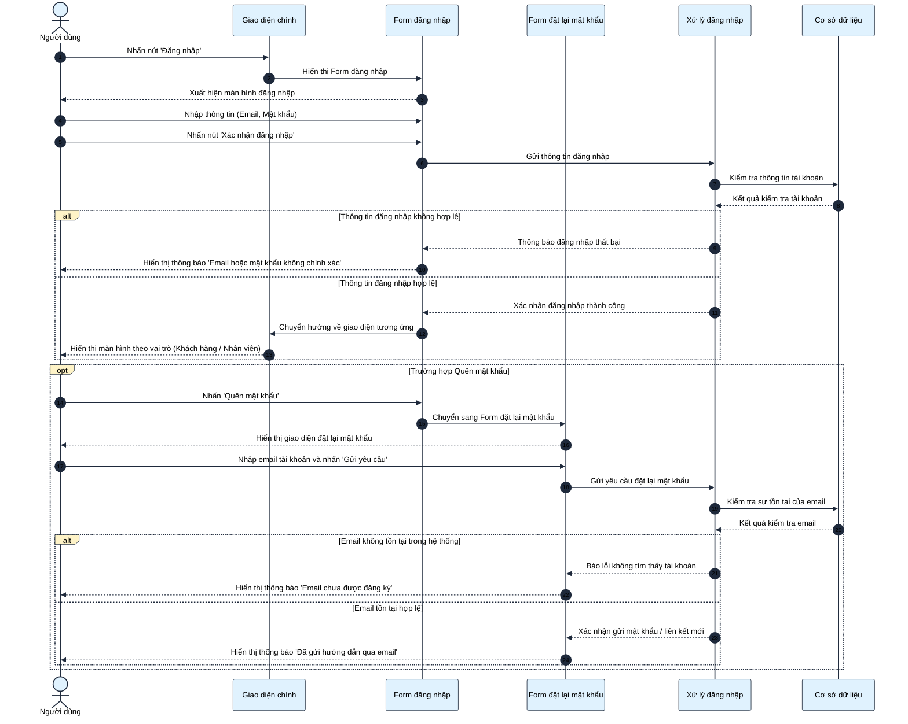

---

### 7.2 Sequence Diagram 2: Luồng Đặt đồ uống & Kiểm tra tồn kho

Lược đồ mô tả quy trình chọn món, kiểm tra điều kiện mã khuyến mãi, xác thực số lượng tồn kho thực tế trong cơ sở dữ liệu và khởi tạo đơn hàng mới với thời hạn thanh toán 15 phút:

> **Tài nguyên biểu đồ:** [Mã nguồn Mermaid (.mmd)](./diagrams/sequence-order-creation.mmd) &bull; Nhập vào Draw.io: `Ctrl + Shift + I`

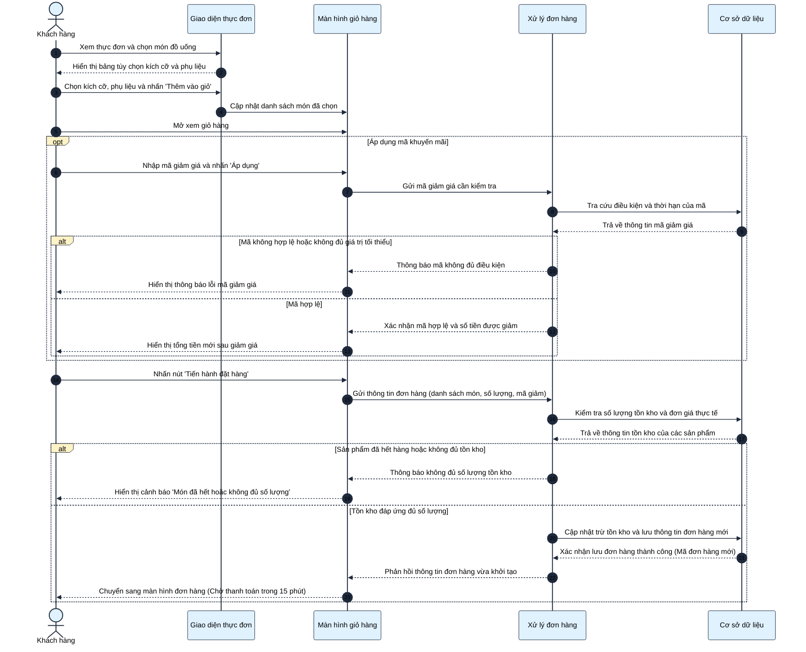

---

### 7.3 Sequence Diagram 3: Luồng Thanh toán không tiền mặt & Tích điểm thưởng

Lược đồ mô tả quy trình thanh toán không tiền mặt, xác thực chống trùng lặp giao dịch (bấm đúp hoặc gửi lặp), cập nhật trạng thái đơn hàng, hoàn trả kho nếu lỗi và cộng điểm thưởng thành viên:

> **Tài nguyên biểu đồ:** [Mã nguồn Mermaid (.mmd)](./diagrams/sequence-idempotent-payment.mmd) &bull; Nhập vào Draw.io: `Ctrl + Shift + I`

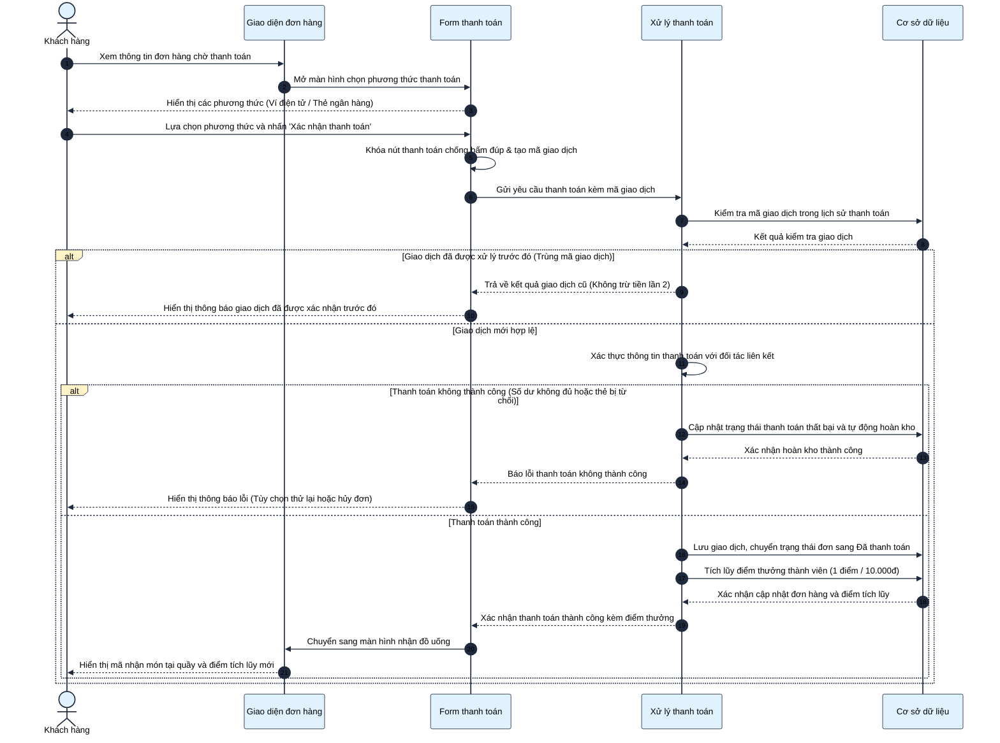

---

### 7.4 Sequence Diagram 4: Luồng Tiếp nhận & Pha chế tại quầy (KDS)

Lược đồ mô tả quy trình vận hành và điều phối chế biến đồ uống tại quầy pha chế qua màn hình quầy bar, bao gồm nạp danh sách đơn theo thứ tự thời gian, chuyển trạng thái qua các nấc chế biến, bàn giao đồ uống cho khách và xử lý sự cố đột xuất tại quầy:

> **Tài nguyên biểu đồ:** [Mã nguồn Mermaid (.mmd)](./diagrams/sequence-staff-kds.mmd) &bull; Nhập vào Draw.io: `Ctrl + Shift + I`

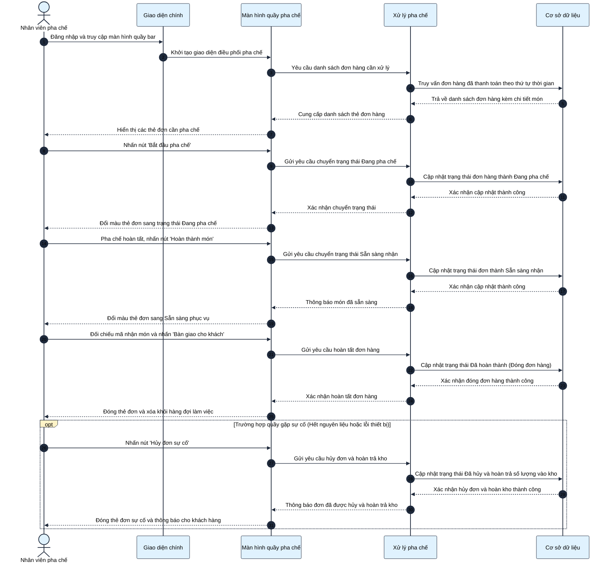

---

## 8. ORDER STATE MACHINE — SƠ ĐỒ MÁY TRẠNG THÁI ĐƠN HÀNG

### 8.1 Biểu đồ chuyển đổi trạng thái đơn hàng (Mermaid)

Sơ đồ máy trạng thái biểu diễn chính xác cấu trúc định nghĩa trong tệp `apps/backend/src/common/state-machine/order-state-machine.ts`, chuẩn hóa theo Mục 9.1 tài liệu đặc tả đồ án BrewLite và các quyết định kỹ thuật trong **ADR-007**:

> **Tài nguyên biểu đồ:** [Mã nguồn Mermaid (.mmd)](./diagrams/order-state-machine.mmd) &bull; Nhập vào Draw.io: `Ctrl + Shift + I`

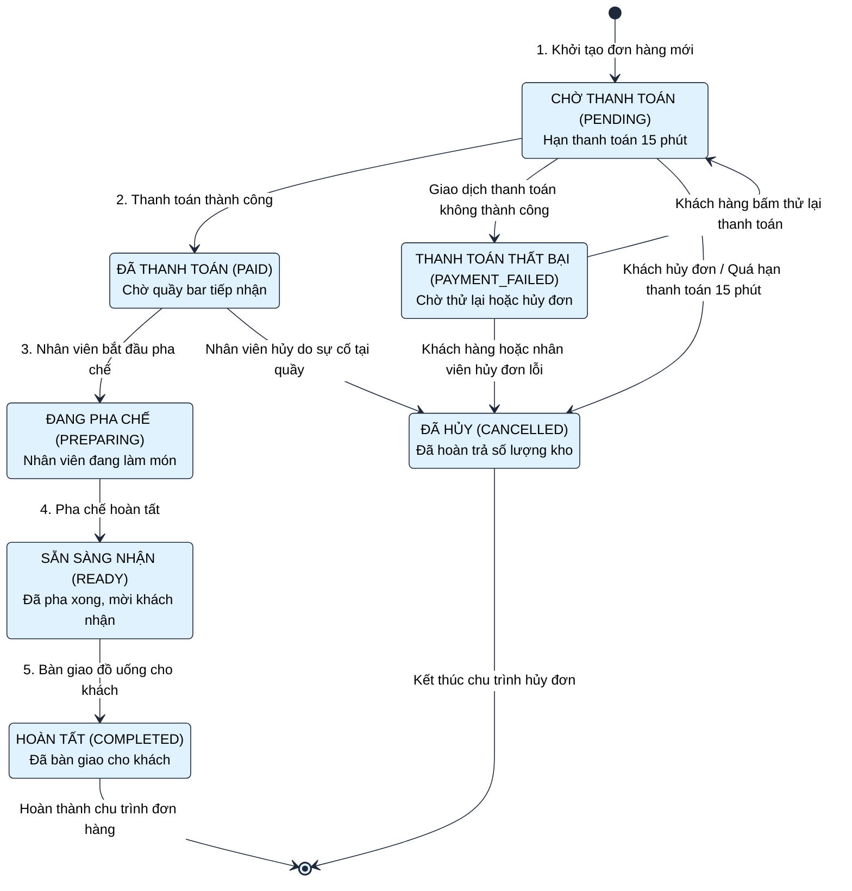

---

### 8.2 Ma trận chuyển đổi trạng thái (State Transition Matrix)

Bảng ma trận thể hiện tính hợp lệ của việc chuyển đổi giữa trạng thái hiện tại (hàng) sang trạng thái kế tiếp (cột). Mọi chuyển đổi đánh dấu ❌ sẽ lập tức bị hệ thống từ chối và thông báo vi phạm thứ tự trạng thái quy định:

| Trạng thái hiện tại \ Đích | `PENDING` | `PAID` | `PREPARING` | `READY` | `COMPLETED` | `PAYMENT_FAILED` | `CANCELLED` |
|---|:---:|:---:|:---:|:---:|:---:|:---:|:---:|
| **`PENDING`** | ❌ | ✅ *(Thanh toán OK)* | ❌ | ❌ | ❌ | ✅ *(Cổng báo lỗi)* | ✅ *(Khách hủy / Quá hạn 15p)* |
| **`PAYMENT_FAILED`** | ✅ *(Thử lại)* | ❌ | ❌ | ❌ | ❌ | ❌ | ✅ *(Hủy đơn lỗi)* |
| **`PAID`** | ❌ | ❌ | ✅ *(Pha chế làm)* | ❌ | ❌ | ❌ | ✅ *(Hủy sự cố tại quầy)* |
| **`PREPARING`** | ❌ | ❌ | ❌ | ✅ *(Pha xong)* | ❌ | ❌ | ❌ *(Đang làm cấm hủy)* |
| **`READY`** | ❌ | ❌ | ❌ | ❌ | ✅ *(Đã giao)* | ❌ | ❌ *(Đã xong cấm hủy)* |
| **`COMPLETED` (Kết thúc)** | ❌ | ❌ | ❌ | ❌ | ❌ | ❌ | ❌ *(Bất biến)* |
| **`CANCELLED` (Kết thúc)** | ❌ | ❌ | ❌ | ❌ | ❌ | ❌ | ❌ *(Bất biến)* |

---

### 8.3 Bảng quy tắc phân quyền và hành động biên (Invariants & Side Effects)

| Chuyển trạng thái | Tác nhân có thẩm quyền | Điều kiện tiền quyết bắt buộc | Tác vụ phụ trợ bắt buộc (Side Effects) |
|---|---|---|---|
| `[*] -> PENDING` | `CUSTOMER` | Giỏ hàng có món, số lượng tồn kho khả dụng đáp ứng đủ. | Mở giao dịch: trừ số lượng tồn kho an toàn có kiểm soát phiên bản, tự động sinh mã đơn thân thiện (dạng `#10xx`), đặt thời hạn thanh toán 15 phút. |
| `PENDING -> PAID` | `CUSTOMER` (qua Cổng thanh toán) | Đơn chưa hết hạn thanh toán, mã giao dịch hợp lệ. | Lưu giao dịch thanh toán thành công, ghi nhận lượt dùng mã khuyến mãi, cộng điểm thưởng tích lũy (1 điểm / 10.000đ). |
| `PENDING -> PAYMENT_FAILED` | `CUSTOMER` (qua Cổng thanh toán liên kết) | Nhận tín hiệu thanh toán thất bại từ đối tác thanh toán. | Lưu giao dịch thanh toán thất bại, **tự động hoàn trả số lượng vào kho**. |
| `PAYMENT_FAILED -> PENDING` | `CUSTOMER` | Khách hàng chủ động bấm "Thử lại thanh toán". | Tạm thời giữ nguyên đơn để tạo giao dịch thanh toán mới. |
| `PENDING -> CANCELLED` | `CUSTOMER` hoặc `CRON_SYSTEM` | Khách tự bấm hủy HOẶC đơn đã quá hạn thanh toán 15 phút. | Cập nhật trạng thái `CANCELLED` và **tự động hoàn trả số lượng vào kho** toàn bộ các sản phẩm trong đơn. |
| `PAYMENT_FAILED -> CANCELLED` | `CUSTOMER` hoặc `STAFF` | Đơn hàng đang ở trạng thái thanh toán lỗi. | Chuyển `CANCELLED` (Số lượng tồn kho đã được hoàn trả ở bước thanh toán lỗi nên không hoàn đúp). |
| `PAID -> PREPARING` | `STAFF` hoặc `ADMIN` | Đơn đã thanh toán thành công, hiển thị tại hàng đợi quầy bar. | Cập nhật trạng thái hiển thị trên màn hình quầy pha chế sang màu cam chỉ báo. |
| `PAID -> CANCELLED` | `STAFF` hoặc `ADMIN` (Đặc quyền) | Sự cố tại quầy (máy hỏng, hết nguyên liệu đột xuất) và **chưa bắt đầu pha chế**. | Khách không được tự hủy. Chỉ Staff/Admin được hủy. Bắt buộc **tự động hoàn trả số lượng vào kho**. |
| `PREPARING -> READY` | `STAFF` hoặc `ADMIN` | Nhân viên đã hoàn thành việc chế biến đồ uống. | Cập nhật trạng thái hiển thị món đã xong, phát tín hiệu mời khách đến quầy nhận nước. |
| `READY -> COMPLETED` | `STAFF` hoặc `ADMIN` | Khách xuất trình mã đơn `#10xx` và nhận đồ uống tại quầy. | Đóng đơn hàng, kết thúc hoàn toàn chu trình đơn. Khóa vĩnh viễn mọi thao tác chỉnh sửa. |

---

## 9. TỔNG KẾT VÀ HƯỚNG DẪN THỰC THI (VERIFICATION & NEXT STEPS)

Tài liệu này đóng vai trò là bản đặc tả kỹ thuật và kiến trúc chuẩn hóa cấp cao nhất (Baseline Architecture Spec) cho toàn bộ dự án **BrewLite VER 1.0**. Tất cả các lập trình viên (Developers), kỹ sư kiểm thử (QA/QC) và giảng viên nghiệm thu cần tuân thủ các nguyên tắc sau:

1. **Tính tương thích mã nguồn:** Mọi thực thể, thuộc tính và tên trường trong ERD và Data Dictionary phải đồng nhất tuyệt đối với tệp lược đồ Prisma `apps/backend/prisma/schema.prisma`.
2. **Tính tuân thủ máy trạng thái:** Tuân thủ nghiêm ngặt ma trận chuyển đổi trạng thái đơn hàng trong mọi luồng xử lý nghiệp vụ.
3. **Kiểm thử tự động bắt buộc:** Bộ kiểm thử tích hợp (Integration Tests) cần bao phủ tối thiểu:
   - Chặn đứng mọi chuyển đổi trạng thái đơn hàng vi phạm ma trận (Task 10.1).
   - Kiểm tra cơ chế chống trùng lặp giao dịch và bảo toàn dữ liệu khi có 2 yêu cầu đồng thời (Task 10.2).
   - Kiểm tra đặt hàng đồng thời có kiểm soát phiên bản tồn kho, không bao giờ bán âm kho (Task 10.3).
   - Kiểm tra dọn dẹp đơn quá hạn 15 phút và hoàn kho tự động của bộ xử lý định kỳ (ADR-007).
4. **Liên kết điều hướng:** Tham chiếu hướng dẫn cài đặt và kịch bản nghiệm thu tại [README.md](../README.md).
